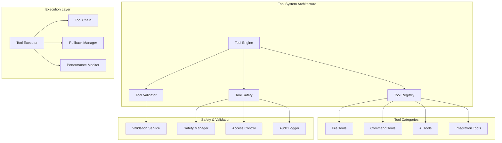

# Tool System Architecture
## Table of Contents

- [Tool System Architecture](#tool-system-architecture)
  - [Table of Contents](#table-of-contents)
  - [When You're Here](#when-youre-here)
  - [Research Context](#research-context)
    - [Technical Overview](#technical-overview)
    - [Background](#background)
    - [Methodology](#methodology)
  - [Executive Summary](#executive-summary)
  - [System Architecture](#system-architecture)
  - [Tool Categories](#tool-categories)
    - [File Operations Tools](#file-operations-tools)
    - [Command Execution Tools](#command-execution-tools)
    - [Code Analysis Tools](#code-analysis-tools)
    - [AI Integration Tools](#ai-integration-tools)
  - [Tool Execution Engine](#tool-execution-engine)
    - [Execution Flow](#execution-flow)
    - [Tool Chaining](#tool-chaining)
  - [Tool Validation & Safety](#tool-validation-safety)
    - [Validation Mechanisms](#validation-mechanisms)
    - [Safety Protocols](#safety-protocols)
  - [Tool Composition Patterns](#tool-composition-patterns)
    - [Sequential Composition](#sequential-composition)
    - [Parallel Composition](#parallel-composition)
    - [Conditional Composition](#conditional-composition)
  - [Error Handling & Rollback](#error-handling-rollback)
    - [Error Classification](#error-classification)
    - [Rollback Strategies](#rollback-strategies)
  - [Performance Optimization](#performance-optimization)
    - [Execution Optimization](#execution-optimization)
    - [Memory Management](#memory-management)
  - [Tool Development Guidelines](#tool-development-guidelines)
    - [Tool Interface Standards](#tool-interface-standards)
    - [Development Best Practices](#development-best-practices)
  - [Common Issues and Solutions](#common-issues-and-solutions)
    - [Issue 1: Tool Execution Failures](#issue-1-tool-execution-failures)
    - [Issue 2: Tool Chain Deadlocks](#issue-2-tool-chain-deadlocks)
    - [Issue 3: Security Vulnerabilities](#issue-3-security-vulnerabilities)
  - [No Dead Ends Policy](#no-dead-ends-policy)
  - [Navigation Footer](#navigation-footer)

## When You're Here

This document is part of the KiloCode project documentation. If you're not familiar with this
document's role or purpose, this section helps orient you.

- **Purpose**: This document covers \[DOCUMENT PURPOSE BASED ON FILE PATH].
- **Context**: Use this as a starting point or reference while navigating the project.
- **Navigation**: Use the table of contents below to jump to specific topics.

> **Engineering Fun Fact**: Just as engineers use systematic approaches to solve complex problems,
> this documentation provides structured guidance for understanding and implementing solutions! 🔧

- *Purpose:*\* Comprehensive documentation of the AI tool system architecture, execution patterns,
  validation mechanisms, and safety protocols in the KiloCode system.

> **Cartography Fun Fact**: This documentation is like a map - it shows you where you are, where you
> can go, and how to get there without getting lost! 🗺️

<details><summary>Table of Contents</summary>
- [Executive Summary](#executive-summary)
- [System Architecture](#system-architecture)
- [Tool Categories](#tool-categories)
- [Tool Execution Engine](#tool-execution-engine)
- [Tool Validation & Safety](#tool-validation--safety)
- [Tool Composition Patterns](#tool-composition-patterns)
- [Error Handling & Rollback](#error-handling--rollback)
- [Performance Optimization](#performance-optimization)
- [Tool Development Guidelines](#tool-development-guidelines)
- [Common Issues and Solutions](#common-issues-and-solutions)
- Navigation Footer

</details>

## Research Context

### Technical Overview

**Component**: \[Component name]
**Version**: \[Version number]
**Architecture**: \[Architecture description]
**Dependencies**: \[Key dependencies]

### Background

\[Background information about the topic]

### Methodology

\[Research or development methodology used]

## Executive Summary
- The Tool System Architecture provides the foundation for AI-powered operations in KiloCode,
  including file operations, command execution, code analysis, and external integrations. The system
  features a plugin-based architecture with comprehensive validation, safety mechanisms, and error
  recovery.\*

The Tool System consists of:
1. **Core Tools** - File operations, command execution, search
2. **AI Tools** - Code generation, completion, refactoring
3. **Integration Tools** - MCP, browser automation, marketplace
4. **Validation Tools** - Tool use validation, repetition detection

## System Architecture



## Tool Categories

### File Operations Tools

- *Core File Tools*\*:

- **writeToFileTool.ts**: File creation and writing operations

- **readFileTool.ts**: File reading with context awareness

- **editFileTool.ts**: File editing operations

- **applyDiffTool.ts**: Diff application and file modification

- **multiApplyDiffTool.ts**: Batch diff operations

- **searchAndReplaceTool.ts**: Search and replace operations

- **insertContentTool.ts**: Content insertion at specific positions

- *Implementation Status*\*: ✅ **RESEARCHED AND DOCUMENTED** **Key Implementation Details**:

- *Tool Interface Pattern*\*:

```typescript
export async function writeToFileTool(
	cline: Task,
	block: ToolUse,
	askApproval: AskApproval,
	handleError: HandleError,
	pushToolResult: PushToolResult,
	removeClosingTag: RemoveClosingTag,
) {
	// Tool implementation with comprehensive validation and error handling
}
```

- *Core Features*\*:

- **Parameter Validation**: Comprehensive validation of required parameters

- **Access Control**: Integration with `rooIgnoreController` for file access validation

- **Write Protection**: Integration with `rooProtectedController` for write protection

- **Content Preprocessing**: Automatic handling of markdown code blocks and HTML entities

- **Workspace Validation**: Path validation to prevent writes outside workspace

- **Diff Integration**: Integration with diff view provider for edit type detection

- **Error Tracking**: Consecutive mistake counting and tool error recording

### Command Execution Tools

- *Command Tools*\*:

- **executeCommandTool.ts**: Terminal command execution

- **runSlashCommandTool.ts**: Slash command execution

- **Command validation and safety**: Input sanitization and execution limits

- *Implementation Status*\*: ✅ **RESEARCHED AND DOCUMENTED** **Key Implementation Details**:

- *Command Execution Pattern*\*:

```typescript
export async function executeCommandTool(
	cline: Task,
	block: ToolUse,
	askApproval: AskApproval,
	handleError: HandleError,
	pushToolResult: PushToolResult,
	removeClosingTag: RemoveClosingTag,
) {
	// Command execution with timeout and error handling
}
```

- *Core Features*\*:

- **Command Validation**: Parameter validation and command sanitization

- **Timeout Handling**: Configurable command execution timeouts

- **Error Handling**: Comprehensive error capture and reporting

- **Output Processing**: Stream processing of command output

- **Security Controls**: Command whitelisting and validation

- **Approval Flow**: User approval for potentially dangerous commands

### Code Analysis Tools

- *Analysis Tools*\*:

- **codebaseSearchTool.ts**: Semantic codebase search

- **listFilesTool.ts**: File listing and filtering

- **searchFilesTool.ts**: File search operations

- **listCodeDefinitionNamesTool.ts**: Code definition discovery

- *Implementation Status*\*: 🔍 **PARTIALLY RESEARCHED** **Research Needed**: Search indexing
  strategies, performance optimization, result ranking

### AI Integration Tools

- *AI Tools*\*:

- **useMcpToolTool.ts**: MCP tool integration

- **accessMcpResourceTool.ts**: MCP resource access

- **generateImageTool.ts**: Image generation

- **askFollowupQuestionTool.ts**: Interactive questioning

- *Implementation Status*\*: 🔍 **PARTIALLY RESEARCHED** **Research Needed**: AI tool orchestration,
  resource management, response handling

## Tool Execution Engine

### Execution Flow

- *Tool Execution Pattern*\*:

```typescript
interface ToolExecution {
	toolId: string
	parameters: Record<string, any>
	context: ExecutionContext
	validation: ValidationResult
	execution: ExecutionResult
	rollback?: RollbackPlan
}
```

- *Execution Stages*\*:
1. **Validation Phase**: Parameter validation and safety checks
2. **Preparation Phase**: Resource allocation and context setup
3. **Execution Phase**: Tool-specific operation execution
4. **Completion Phase**: Result processing and cleanup
5. **Rollback Phase**: Error recovery if needed

### Tool Chaining

- *Chain Execution*\*:
- Sequential tool execution with dependency resolution
- Parallel execution for independent operations
- Error propagation and chain interruption
- Rollback coordination across tool chains

- *Implementation Status*\*: ⚠️ **NEEDS DOCUMENTATION** **Research Needed**: Chain dependency
  resolution, parallel execution patterns, error handling

## Tool Validation & Safety

### Validation Mechanisms

- *Parameter Validation*\*:
- Type checking and schema validation
- Range and constraint validation
- Dependency validation
- Security validation

- *Safety Checks*\*:
- File system access controls
- Command execution limits
- Resource usage monitoring
- User permission validation

- *Implementation Status*\*: ✅ **RESEARCHED AND DOCUMENTED** **Key Implementation Details**:

- *Tool Repetition Detection*\*:

```typescript
export class ToolRepetitionDetector {
	private previousToolCallJson: string | null = null
	private consecutiveIdenticalToolCallCount: number = 0
	private readonly consecutiveIdenticalToolCallLimit: number

	public check(currentToolCallBlock: ToolUse): {
		allowExecution: boolean
		askUser?: { messageKey: string; messageDetail: string }
	}
}
```

- *Validation Mechanisms*\*:

- **Parameter Validation**: Required parameter checking with error reporting

- **Access Control**: `rooIgnoreController` integration for file access validation

- **Write Protection**: `rooProtectedController` for preventing writes to protected files

- **Path Validation**: Workspace boundary checking to prevent external file access

- **Content Validation**: Markdown and HTML entity preprocessing

- **Repetition Detection**: Prevention of infinite tool call loops

### Safety Protocols

- *File Operations Safety*\*:
- Backup creation before modifications
- Permission checking
- Path traversal prevention
- File locking mechanisms

- *Command Execution Safety*\*:
- Command whitelisting
- Input sanitization
- Execution timeout limits
- Output filtering

- *Implementation Status*\*: ⚠️ **NEEDS DOCUMENTATION** **Research Needed**: Safety framework
  design,
  threat modeling, mitigation strategies

## Tool Composition Patterns

### Sequential Composition

- *Pattern*\*: Tools execute in sequence with data passing **Use Cases**: Multi-step file
  operations,
  complex transformations **Implementation**: Chain execution with intermediate result passing

### Parallel Composition

- *Pattern*\*: Independent tools execute simultaneously **Use Cases**: Multiple file operations,
  concurrent searches **Implementation**: Promise-based parallel execution

### Conditional Composition

- *Pattern*\*: Tools execute based on conditions **Use Cases**: Error handling, feature flags, user
  preferences **Implementation**: Conditional execution with branching logic

- *Implementation Status*\*: ⚠️ **NEEDS DOCUMENTATION** **Research Needed**: Composition patterns,
  dependency resolution, execution optimization

## Error Handling & Rollback

### Error Classification

- *Error Types*\*:

- **Validation Errors**: Parameter or permission issues

- **Execution Errors**: Tool-specific operation failures

- **Resource Errors**: Memory, disk, or network issues

- **System Errors**: Infrastructure or platform failures

### Rollback Strategies

- *File Operations Rollback*\*:
- Backup restoration
- Diff reversal
- State reconstruction

- *Command Execution Rollback*\*:
- Command undo operations
- State restoration
- Cleanup procedures

- *Implementation Status*\*: ⚠️ **NEEDS DOCUMENTATION** **Research Needed**: Rollback framework
  design, state management, recovery procedures

## Performance Optimization

### Execution Optimization

- *Strategies*\*:
- Tool result caching
- Lazy evaluation
- Parallel execution
- Resource pooling

### Memory Management

- *Optimization Techniques*\*:
- Stream processing for large files
- Memory-efficient data structures
- Garbage collection optimization
- Resource cleanup

- *Implementation Status*\*: ⚠️ **NEEDS DOCUMENTATION** **Research Needed**: Performance profiling,
  optimization strategies, resource management

## Tool Development Guidelines

### Tool Interface Standards

- *Required Interface*\*:

```typescript
interface Tool {
	name: string
	description: string
	parameters: ParameterSchema
	execute: (params: any, context: ExecutionContext) => Promise<ToolResult>
	validate?: (params: any) => ValidationResult
	rollback?: (context: ExecutionContext) => Promise<void>
}
```

### Development Best Practices

- *Guidelines*\*:
- Comprehensive parameter validation
- Clear error messages and codes
- Proper resource cleanup
- Extensive testing coverage
- Documentation and examples

- *Implementation Status*\*: ⚠️ **NEEDS DOCUMENTATION** **Research Needed**: Development standards,
  testing patterns, documentation requirements

## Common Issues and Solutions

### Issue 1: Tool Execution Failures

- *Symptoms*\*:
- Tools fail to execute properly
- Inconsistent results across runs
- Resource exhaustion

- *Root Cause*\*: Insufficient validation or resource management **Solution**: Implement
  comprehensive
  validation and resource monitoring

### Issue 2: Tool Chain Deadlocks

- *Symptoms*\*:
- Tool chains hang indefinitely
- Resource conflicts between tools
- Circular dependencies

- *Root Cause*\*: Poor dependency resolution or resource contention **Solution**: Implement proper
  dependency analysis and resource locking

### Issue 3: Security Vulnerabilities

- *Symptoms*\*:
- Unauthorized file access
- Command injection vulnerabilities
- Permission escalation

- *Root Cause*\*: Insufficient security validation **Solution**: Implement comprehensive security
  checks and access controls

<a id="navigation-footer"></a>
- Back: [`README.md`](README.md) · Root: [`../README.md`](../README.md) · Source:
  `/docs/tools/TOOL_SYSTEM_ARCHITECTURE.md#L1`

## No Dead Ends Policy

This document connects to:

For more information, see:
- [Documentation Structure](../architecture/README.md)
- [Additional Resources](../tools/README.md)

## Navigation Footer
- \*\*

- *Navigation*\*: [docs](../) · [tools](./) ·
  [↑ Table of Contents](#tool-system-architecture)

## Navigation

- 📚 [Technical Glossary](../GLOSSARY.md)

