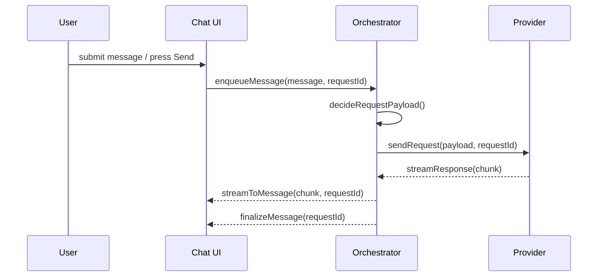

# UI\_CHAT\_TASK\_WINDOW

> **Engineering Fun Fact**: Just as engineers use systematic approaches to solve complex problems, this documentation provides structured guidance for understanding and implementing solutions! 🔧
- *Purpose:*\* Describe the chat / task window UI, how user actions map to orchestrator actions, the
  control loop that decides when to fire API requests (including payload construction), how messages
  are displayed (including timestamps), and troubleshooting steps for duplicate API requests.

> **Cartography Fun Fact**: This documentation is like a map - it shows you where you are, where you
> can go, and how to get there without getting lost! 🗺️

Table of contents

- \[1. Related Documents
- 2. UI Overview
- 3. Message Flow & Control Loop
- 4. Request Payloads & Timing (timestamps)
- 5. State, Persistence & Rendering
- 6. Debugging: duplicate API requests
- 7. Instrumentation & Logs
- 8. Troubleshooting & UX notes
- Navigation Footer

## 1. Related Documents]\(1-related-documents---2-ui-overview---3-message-flow-control-loop---4-request-payloads-timing-timestamps---5-state-persistence-rendering---6-debugging-duplicate-api-requests---7-instrumentation-logs---8-troubleshooting-ux-notes---navigation-footer-summary-details-a-namerelated-docsa-1-related-documents-)
- Backend lifecycle and task orchestration: [`ORCHESTRATOR_LIFECYCLE.md`](../orchestrator/ORCHESTRATOR_LIFECYCLE.md)
- Task delegation & subtasking: [`ORCHESTRATOR_TASK_DELEGATION.md`](../orchestrator/ORCHESTRATOR_TASK_DELEGATION.md)
- UI feature docs (external):
  [`../apps/kilocode-docs/docs/features/settings-management.md`](../apps/kilocode-docs/docs/features/settings-management.md)

[Back to Top](#)

## 2. UI Overview

This section describes the primary parts of the chat / task window and their responsibilities.

### 2.1 Panels & Controls
- Chat input: free-text input where users type prompts.
- Shortcut dropdown (model switcher): updates the model for the next request.
- Message list: chronological list of messages and system responses.
- Task / plan view: optional panel showing current plan or subtasks.
- Status indicators: show request state (pending, in\_progress, streaming, completed, error).
- Controls: Send, Stop/Cancel, Retry.

### 2.2 Display conventions
- Messages show: Author (User / System / Assistant), Body (Markdown), Timestamp, and status badges.
- Streaming responses should show a streaming indicator and update the message body incrementally.
- Keep operations idempotent: UI should attach a client-side requestId to each enqueued request.

[Back to Top](#)

## 3. Message Flow & Control Loop

This section documents the control loop that decides when the UI or orchestrator issues requests.

### 3.1 High-level flow

### 3.2 When requests are issued
- UI-initiated: user presses Send (explicit) or uses a shortcut (explicit).
- Orchestrator-initiated: subtasks, follow-ups or scheduled actions trigger initiateTaskLoop() in
  the orchestrator.
- Guard conditions before issuing: no activeRequest for same chat turn, request payload validated,
  and requestId generated.
- Debounce UI actions (100–250ms) for rapid input events; do not fire on every keystroke.

[Back to Top](#)

## 4. Request Payloads & Timing (timestamps)

### 4.1 Payload composition
- Each outgoing request should include:
- requestId (client-generated short uuid)
- messages: recent message window (trimmed by token budget)
- system/context frames (persistent prompts)
- model/profile and provider hints
- request-level options (max tokens, temperature, streaming flag)
- metadata (workspace, file, task id if applicable)

### 4.2 Timestamps and logging
- Attach timestamps at meaningful points:
- ui\_enqueue\_timestamp: when user action enqueued
- orchestrator\_dispatch\_timestamp: when orchestrator hands to provider
- provider\_start\_timestamp: when provider sends first token
- provider\_response\_timestamp: when final response received
- Log requestId with each timestamp to correlate events across layers.
- Display timestamps in UI as local-time derived from ISO-8601 UTC stored on messages (e.g.
  2025-09-19T20:47:27Z).

[Back to Top](#)

## 5. State, Persistence & Rendering

### 5.1 In-memory vs persisted state
- In-memory UI state: draft message, temporary streaming buffers, UI flags (send disabled).
- Persisted state: conversation history, message timestamps, model/profile preferences, saved
  drafts.
- Best practice: persist conversation messages and request metadata so re-renders or reconstructions
  keep consistent times and ids.

### 5.2 Rendering notes
- Preserve edit buffer across rerenders; use controlled components.
- Include data attributes on message elements: data-request-id, data-provider-id to assist
  debugging.
- Render streaming chunks progressively and finalize when stream completes.

[Back to Top](#)

## 6. Debugging: duplicate API requests

If multiple API requests are observed for a single user action, check:
- UI double-send: Send handler bound multiple times, or button not disabled during send.
- Duplicate event listeners: components mounted twice.
- Re-entrant control loop: both UI and orchestrator trigger send; missing dedupe by requestId.
- Streaming vs finalization race: start-of-stream triggers finalization incorrectly.
- Retries / fallback paths: timeouts or fallback logic issuing additional requests.

### 6.1 Diagnostics
- Add logging at: UI.enqueue(requestId), Orchestrator.dispatch(requestId),
  Provider.start(requestId).
- Correlate request timestamps and requestIds across logs.
- Search for multiple UI.enqueue events for same action.

### 6.2 Quick fixes
- Disable send button on click and re-enable after complete/error.
- Add debounce (100–250ms) or guard flag activeRequest per chat turn.
- Attach and check client-generated requestId; orchestrator should skip if activeRequest exists for
  same id.
- Use cancellation tokens to cancel in-flight provider calls when superseded.

[Back to Top](#)

## 7. Instrumentation & Logs
- Recommended logs: enqueue, dispatch, provider start, provider chunk, provider end, finalization.
- Include requestId, timestamps, user action trace, and short payload hash in logs.
- For reproduction, capture network & console traces and the requestId shown in UI metadata.

[Back to Top](#)

## 8. Troubleshooting & UX notes
- UX: surface clear states: "Request queued", "Streaming", "Completed", "Error".
- Show request progress and provide a Cancel action for long-running requests.
- When fallbacks occur (shell integration timeouts), present the fallback reason in logs and UI.
- For developers: enable verbose orchestrator logging to capture guard evaluation and retries.

[Back to Top](#)
- \*\*

Navigation:
- Index: [`docs/ORCHESTRATOR_LIFECYCLE.md`](../orchestrator/ORCHESTRATOR_LIFECYCLE.md)
- Task delegation: [`docs/ORCHESTRATOR_TASK_DELEGATION.md`](../orchestrator/ORCHESTRATOR_TASK_DELEGATION.md)

## Navigation Footer
- \*\*
- *Navigation*\*: [docs](../) · [ui](../../docs/ui/) ·
  [↑ Table of Contents](#uichattaskwindow)
