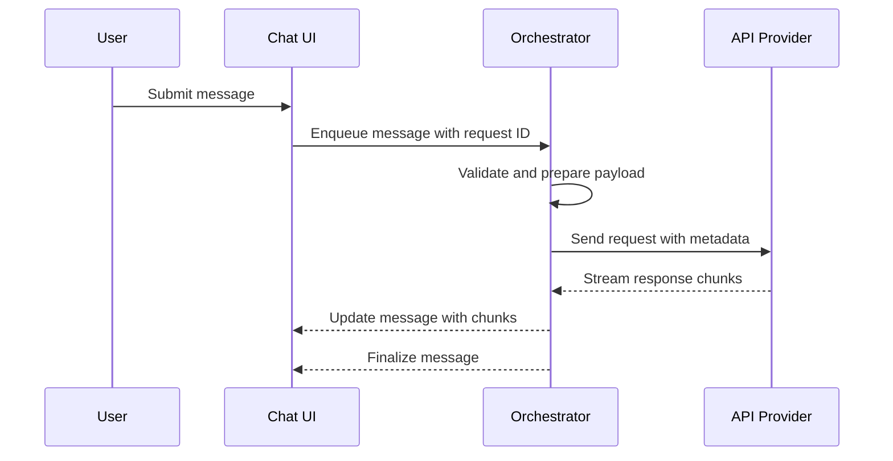

# Chat Task Window System

## When You're Here

This document provides comprehensive coverage of KiloCode's chat interface and task window components. It covers user interaction patterns, message flow control, and troubleshooting procedures.

- **Purpose**: Complete guide to chat interface and task window implementation
- **Context**: Essential reading for developers working on chat features or debugging message flow issues
- **Navigation**: Use the table of contents below to jump to specific topics

## Table of Contents
- [Overview](#overview)
- [UI Components](#ui-components)
- [Message Flow Control](#message-flow-control)
- [Request Payloads and Timing](#request-payloads-and-timing)
- [State Management and Rendering](#state-management-and-rendering)
- [Debugging Duplicate Requests](#debugging-duplicate-requests)
- [Instrumentation and Logging](#instrumentation-and-logging)
- [Troubleshooting Guide](#troubleshooting-guide)
- [Navigation](#navigation)

## Overview

This document describes the chat and task window user interface components, including user interaction patterns, message flow control, request payload construction, and troubleshooting procedures for duplicate API requests. The chat interface is the primary user interaction point for communicating with KiloCode's AI systems.

## UI Components

The chat and task window interface consists of several key components that work together to provide a seamless user experience.

### Primary Panels and Controls

- **Chat Input**: Free-text input field where users compose their prompts and messages
- **Model Switcher**: Dropdown control for selecting the AI model for the next request
- **Message List**: Chronological display of conversation history including user messages, system responses, and status indicators
- **Task View**: Optional panel displaying current plans, subtasks, and execution progress
- **Status Indicators**: Visual feedback showing request states (pending, in progress, streaming, completed, error)
- **Action Controls**: Send button, Stop/Cancel functionality, and Retry options

### Display Conventions

- **Message Format**: Each message displays author (User/System/Assistant), formatted content (Markdown), timestamp, and status badges
- **Streaming Responses**: Real-time updates with streaming indicators and incremental content updates
- **Idempotency**: UI attaches client-side request IDs to ensure operation consistency

## Message Flow Control

The system implements a sophisticated control loop to manage when and how API requests are initiated, preventing duplicate requests and ensuring reliable communication.

### High-Level Flow

### Request Initiation Triggers

- **User Actions**: Explicit send button press or shortcut key activation
- **Orchestrator Actions**: Subtask execution, follow-up operations, or scheduled tasks
- **Guard Conditions**: Validates no active requests exist for the same chat turn, payload validation passes, and unique request ID is generated
- **Debouncing**: UI actions are debounced (100-250ms) to prevent rapid-fire requests

## Request Payloads and Timing

### Payload Composition

Each API request includes comprehensive metadata to ensure proper processing and tracking:

- **Request ID**: Client-generated unique identifier for tracking and deduplication
- **Message History**: Recent conversation window optimized for token budget
- **System Context**: Persistent prompts and context frames
- **Model Configuration**: Provider hints and model selection
- **Request Options**: Token limits, temperature settings, streaming preferences
- **Metadata**: Workspace context, file references, and task identifiers

### Timestamp Management

The system tracks timestamps at critical points to monitor performance and debug issues:

- **UI Enqueue**: When user action is queued for processing
- **Orchestrator Dispatch**: When request is handed to the provider
- **Provider Start**: When first response token is received
- **Provider Complete**: When final response is received

All timestamps are stored in ISO-8601 UTC format and displayed in local time in the UI.

## State Management and Rendering

### State Categories

- **In-Memory State**: Draft messages, streaming buffers, UI flags (send button state)
- **Persisted State**: Conversation history, message timestamps, user preferences, saved drafts

### Rendering Best Practices

- **Controlled Components**: Preserve edit buffers across re-renders
- **Debugging Support**: Include data attributes (request ID, provider ID) on message elements
- **Progressive Updates**: Render streaming content incrementally until completion

## Debugging Duplicate Requests

### Common Causes

- **UI Double-Send**: Multiple event handlers or button state management issues
- **Component Remounting**: Duplicate event listeners from component lifecycle issues
- **Control Loop Conflicts**: Both UI and orchestrator triggering requests without deduplication
- **Streaming Race Conditions**: Incorrect finalization logic during streaming
- **Retry Logic**: Timeout handling or fallback mechanisms creating additional requests

### Diagnostic Procedures

1. **Add Logging Points**: Track enqueue, dispatch, and provider start events
2. **Correlate Timestamps**: Use request IDs to trace request flow across layers
3. **Identify Patterns**: Look for multiple enqueue events for single user actions

### Quick Resolution Steps

- **Disable Send Button**: Prevent multiple clicks during request processing
- **Implement Debouncing**: Add 100-250ms delay for rapid user actions
- **Request ID Validation**: Orchestrator should skip requests with existing active IDs
- **Cancellation Tokens**: Cancel in-flight requests when superseded

## Instrumentation and Logging

### Recommended Log Points

- Request enqueue (UI level)
- Request dispatch (Orchestrator level)
- Provider start and chunk events
- Request completion and finalization

### Log Content

Include request ID, timestamps, user action traces, and payload hashes for comprehensive debugging support.

## Troubleshooting Guide

### User Experience Considerations

- **Clear State Indicators**: Display "Request Queued", "Streaming", "Completed", "Error" states
- **Progress Feedback**: Show request progress and provide cancel functionality
- **Fallback Communication**: Clearly communicate when fallback mechanisms are activated

### Developer Tools

- **Verbose Logging**: Enable detailed orchestrator logging for guard evaluation and retry analysis
- **Network Traces**: Capture network and console traces with request IDs for reproduction

## Navigation

- [← Back to UI Documentation](README.md)
- [→ UI Layer System](UI_LAYER_SYSTEM.md)
- [→ Message Flow System](UI_MESSAGE_FLOW_SYSTEM.md)
