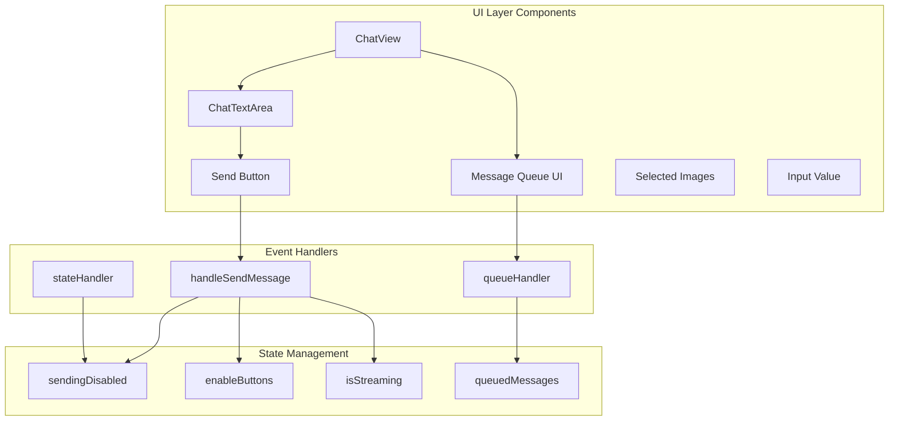
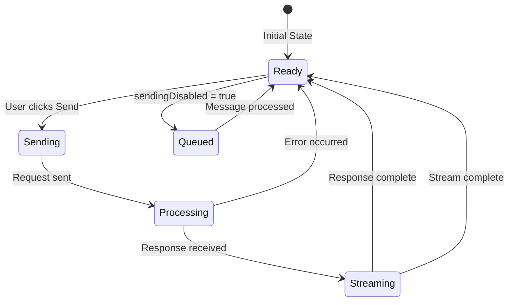

# UI Layer System

> **Architecture Fun Fact**: Like a well-designed building, good documentation has a solid foundation, clear structure, and intuitive navigation! 🏗️

**Purpose:** Comprehensive documentation of the UI Layer system components, including Chat UI, Send
Button, and Message Queue UI components and their interactions.

> **Cartography Fun Fact**: This documentation is like a map - it shows you where you are, where you
> can go, and how to get there without getting lost! 🗺️

<details><summary>Table of Contents</summary>

- [Executive Summary](#executive-summary)
- [System Architecture](#system-architecture)
- [Chat UI Component](#chat-ui-component)
- [Send Button Component](#send-button-component)
- [Message Queue UI](#message-queue-ui)
- [State Management](#state-management)
- [Event Handling](#event-handling)
- [Common Issues and Solutions](#common-issues-and-solutions)
- Navigation Footer

</details>

## Executive Summary

_The UI Layer system manages all user interface components for the chat interface, including the
main chat view, send button controls, and message queue display. This layer is responsible for user
interactions, state visualization, and communication with the backend systems._

The UI Layer consists of three main components:

1. **Chat UI** - Main chat interface and message display
2. **Send Button** - User input controls and request initiation
3. **Message Queue UI** - Visual representation of queued messages

## System Architecture



## Chat UI Component

### ChatView Component

**Location**: `webview-ui/src/components/chat/ChatView.tsx`

**Responsibilities**:

- Main chat interface container
- Message display and rendering
- State coordination between components
- Communication with backend via webview

**Key Features**:

```typescript
export interface ChatViewProps {
	isHidden: boolean
	showAnnouncement: boolean
	hideAnnouncement: () => void
}

export interface ChatViewRef {
	acceptInput: () => void
	focusInput: () => void
}
```

**State Management**:

```typescript
const [inputValue, setInputValue] = useState("")
const [sendingDisabled, setSendingDisabled] = useState(false)
const [selectedImages, setSelectedImages] = useState<string[]>([])
const [queuedMessages, setQueuedMessages] = useState<QueuedMessage[]>([])
```

### Message Display

**Component**: `ChatRow`

- Displays individual messages
- Handles different message types (user, assistant, system)
- Manages message formatting and rendering

**Features**:

- Markdown rendering
- Code syntax highlighting
- Image display
- Message timestamps
- Status indicators

## Send Button Component

### ChatTextArea Component

**Location**: `webview-ui/src/components/chat/ChatTextArea.tsx`

**Responsibilities**:

- Text input area
- Send button control
- Image selection
- Mode and profile selection
- Input validation

**Interface**:

```typescript
interface ChatTextAreaProps {
	inputValue: string
	setInputValue: (value: string) => void
	sendingDisabled: boolean
	selectApiConfigDisabled: boolean
	placeholderText: string
	selectedImages: string[]
	setSelectedImages: React.Dispatch<React.SetStateAction<string[]>>
	onSend: () => void
	onSelectImages: () => void
	shouldDisableImages: boolean
	onHeightChange?: (height: number) => void
	mode: Mode
	setMode: (value: Mode) => void
	modeShortcutText: string
	isEditMode?: boolean
	onCancel?: () => void
}
```

### Send Button Logic

**State-Dependent Behavior**:

```typescript
const handleSendMessage = useCallback(
	(text: string, images: string[]) => {
		text = text.trim()

		if (text || images.length > 0) {
			if (sendingDisabled) {
				// Queue message instead of sending immediately
				try {
					console.log("queueMessage", text, images)
					vscode.postMessage({ type: "queueMessage", text, images })
				} catch (error) {
					console.error("Failed to queue message:", error)
				}
			} else {
				// Send immediately
				vscode.postMessage({ type: "newTask", text, images })
			}
		}
	},
	[sendingDisabled],
)
```

**Button State Management**:

```typescript
<button
    aria-label={t("chat:sendMessage")}
    disabled={sendingDisabled}
    onClick={!sendingDisabled ? onSend : undefined}
    className={cn(
        "relative inline-flex items-center justify-center",
        "bg-transparent border-none p-1.5",
        "border border-[rgba(255,255,255,0.08)] rounded-md",
        "hover:bg-[rgba(255,255,255,0.03)] hover:border-[rgba(255,255,255,0.15)]",
        "focus:outline-none focus-visible:ring-1 focus-visible:ring-vscode-focusBorder",
        "active:bg-[rgba(255,255,255,0.1)]",
        !sendingDisabled && "cursor-pointer",
        sendingDisabled &&
            "opacity-40 cursor-not-allowed grayscale-[30%] hover:bg-transparent hover:border-[rgba(255,255,255,0.08)] active:bg-transparent",
    )}
>
    <SendHorizontal className="w-4 h-4" />
</button>
```

## Message Queue UI

### QueuedMessages Component

**Location**: `webview-ui/src/components/chat/QueuedMessages.tsx`

**Purpose**: Visual representation of queued messages when the system is busy

**Features**:

- Display queued message count
- Show message previews
- Allow message removal
- Allow message editing

**Implementation**:

```typescript
export const QueuedMessages: React.FC<QueuedMessagesProps> = ({
    messages,
    onRemove,
    onEdit
}) => {
    if (messages.length === 0) return null

    return (
        <div className="queued-messages">
            {messages.map((message) => (
                <div key={message.id} className="queued-message">
                    <span className="message-text">
                        {message.text.substring(0, 50)}...
                    </span>
                    <button onClick={() => onRemove(message.id)}>
                        Remove
                    </button>
                    <button onClick={() => onEdit(message.id)}>
                        Edit
                    </button>
                </div>
            ))}
        </div>
    )
}
```

### Queue State Integration

**Connection to Backend**:

```typescript
useEffect(() => {
	const currentTask = provider.getCurrentTask()
	if (currentTask?.messageQueueService) {
		const handleQueueStateChange = (messages: QueuedMessage[]) => {
			setQueuedMessages(messages)
		}

		currentTask.messageQueueService.on("stateChanged", handleQueueStateChange)

		return () => {
			currentTask.messageQueueService.off("stateChanged", handleQueueStateChange)
		}
	}
}, [provider])
```

## State Management

### State Variables

**Primary State**:

```typescript
const [sendingDisabled, setSendingDisabled] = useState(false)
const [enableButtons, setEnableButtons] = useState(false)
const [isStreaming, setIsStreaming] = useState(false)
const [inputValue, setInputValue] = useState("")
const [selectedImages, setSelectedImages] = useState<string[]>([])
const [queuedMessages, setQueuedMessages] = useState<QueuedMessage[]>([])
```

### State Transitions



### State Synchronization

**Task State Integration**:

```typescript
useEffect(() => {
	const currentTask = provider.getCurrentTask()
	if (currentTask) {
		const checkTaskState = () => {
			if (!currentTask.isStreaming && !currentTask.isWaitingForFirstChunk) {
				setSendingDisabled(false)
			}
		}

		// Check state periodically
		const interval = setInterval(checkTaskState, 1000)

		return () => clearInterval(interval)
	}
}, [provider])
```

## Event Handling

### Message Send Events

**Primary Handler**:

```typescript
const handleSendMessage = useCallback(
	(text: string, images: string[]) => {
		text = text.trim()

		if (text || images.length > 0) {
			if (sendingDisabled) {
				// Queue message instead of sending immediately
				vscode.postMessage({ type: "queueMessage", text, images })
			} else {
				// Send immediately
				vscode.postMessage({ type: "newTask", text, images })
			}
		}
	},
	[sendingDisabled],
)
```

### Keyboard Events

**Enter Key Handling**:

```typescript
const handleKeyDown = useCallback(
	(event: React.KeyboardEvent) => {
		if (event.key === "Enter" && !event.shiftKey) {
			event.preventDefault()
			if (!sendingDisabled) {
				handleSendMessage(inputValue, selectedImages)
			}
		}
	},
	[sendingDisabled, inputValue, selectedImages, handleSendMessage],
)
```

### Webview Communication

**Message Types**:

- `newTask` - Create new task with message
- `queueMessage` - Queue message for later processing
- `removeQueuedMessage` - Remove queued message
- `editQueuedMessage` - Edit queued message

## Common Issues and Solutions

### Issue 1: Send Button Stuck Disabled

**Symptoms**:

- Send button remains disabled after request completion
- User cannot send new messages
- UI appears frozen

**Root Cause**: `sendingDisabled` state not properly reset

**Solution**:

```typescript
// Ensure proper state reset
useEffect(() => {
	const currentTask = provider.getCurrentTask()
	if (currentTask) {
		const checkTaskState = () => {
			if (!currentTask.isStreaming && !currentTask.isWaitingForFirstChunk) {
				setSendingDisabled(false)
			}
		}

		const interval = setInterval(checkTaskState, 1000)
		return () => clearInterval(interval)
	}
}, [provider])
```

### Issue 2: Multiple Messages Queued

**Symptoms**:

- Same message appears multiple times in queue
- Multiple API requests for single user action
- Queue UI shows duplicates

**Root Cause**: Message queued multiple times due to rapid user interaction

**Solution**:

```typescript
// Implement debounced message queuing
const debouncedQueueMessage = useMemo(
	() =>
		debounce((text: string, images: string[]) => {
			vscode.postMessage({ type: "queueMessage", text, images })
		}, 300),
	[],
)
```

### Issue 3: Button State Inconsistency

**Symptoms**:

- Button appears enabled but request is blocked
- Button appears disabled but request goes through
- Visual state doesn't match actual state

**Root Cause**: State updates not properly synchronized

**Solution**:

```typescript
// Implement state validation
const validateButtonState = useCallback(() => {
	const currentTask = provider.getCurrentTask()
	const expectedSendingDisabled = currentTask?.isStreaming || currentTask?.isWaitingForFirstChunk || false

	if (sendingDisabled !== expectedSendingDisabled) {
		console.warn("Button state inconsistency detected, correcting")
		setSendingDisabled(expectedSendingDisabled)
	}
}, [sendingDisabled, provider])
```

<a id="navigation-footer"></a>

- Back: [`README.md`](README.md) · Root: [`../README.md`](../README.md) · Source:
  `/docs/ui/UI_LAYER_SYSTEM.md#L1`

## Navigation Footer

---

**Navigation**: [docs](../) · [ui](../docs/ui/) · [↑ Table of Contents](#ui-layer-system)
