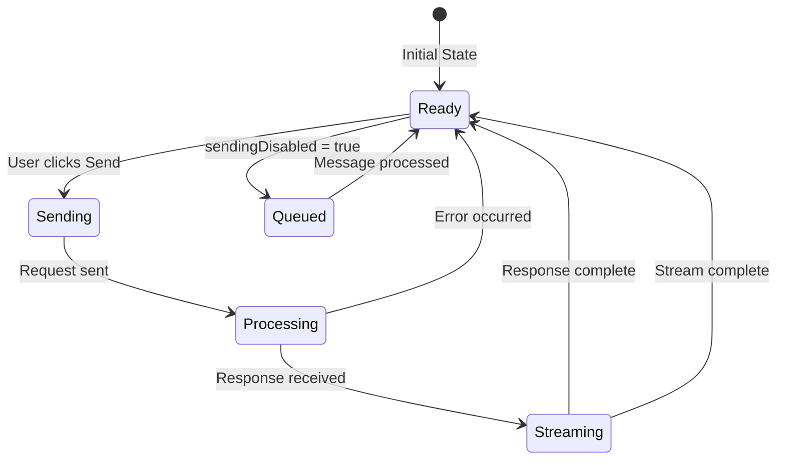

# UI Layer System Architecture

## Table of Contents

* [UI Layer System Architecture](#ui-layer-system-architecture)
* [Table of Contents](#table-of-contents)
* [When You're Here](#when-youre-here)
* [Research Context](#research-context)
* [Technical Overview](#technical-overview)
* [Background](#background)
* [Methodology](#methodology)
* [Overview](#overview)
* [System Components](#system-components)
* [Chat Interface Component](#chat-interface-component)
* [ChatView Component](#chatview-component)
* [Message Display System](#message-display-system)
* [Send Controls Component](#send-controls-component)
* [ChatTextArea Component](#chattextarea-component)
* [Send Button Logic](#send-button-logic)
* [Message Queue System](#message-queue-system)
* [QueuedMessages Component](#queuedmessages-component)
* [Queue State Integration](#queue-state-integration)
* [State Management](#state-management)
* [Primary State Variables](#primary-state-variables)
* [State Transition Flow](#state-transition-flow)
* [State Synchronization](#state-synchronization)
* [Event Handling](#event-handling)
* [Message Send Events](#message-send-events)
* [Keyboard Events](#keyboard-events)
* [Webview Communication](#webview-communication)
* [Troubleshooting Guide](#troubleshooting-guide)
* [Send Button Stuck Disabled](#send-button-stuck-disabled)
* [Multiple Messages Queued](#multiple-messages-queued)
* [Button State Inconsistency](#button-state-inconsistency)
* [No Dead Ends Policy](#no-dead-ends-policy)
* [Navigation](#navigation)
* [Navigation](#navigation)
* [UI Layer System Architecture](#ui-layer-system-architecture)
* [Table of Contents](#table-of-contents)
* [When You're Here](#when-youre-here)
* [Research Context](#research-context)
* [Technical Overview](#technical-overview)
* [Background](#background)
* [Methodology](#methodology)
* [Overview](#overview)
* [System Components](#system-components)
* [Chat Interface Component](#chat-interface-component)
* [ChatView Component](#chatview-component)
* [Message Display System](#message-display-system)
* [Send Controls Component](#send-controls-component)
* [ChatTextArea Component](#chattextarea-component)
* [Send Button Logic](#send-button-logic)
* [Message Queue System](#message-queue-system)
* [QueuedMessages Component](#queuedmessages-component)
* [Queue State Integration](#queue-state-integration)
* [State Management](#state-management)
* [Primary State Variables](#primary-state-variables)
* [State Transition Flow](#state-transition-flow)
* [State Synchronization](#state-synchronization)
* [Event Handling](#event-handling)
* [Message Send Events](#message-send-events)
* [Keyboard Events](#keyboard-events)
* [Webview Communication](#webview-communication)
* [Troubleshooting Guide](#troubleshooting-guide)
* [Send Button Stuck Disabled](#send-button-stuck-disabled)
* [Multiple Messages Queued](#multiple-messages-queued)
* [Button State Inconsistency](#button-state-inconsistency)
* [No Dead Ends Policy](#no-dead-ends-policy)
* [Navigation](#navigation)
* ↑ [Table of Contents](#table-of-contents)

## When You're Here

🔍 **Did You Know**: \[Interesting insight]

This document provides a comprehensive overview of KiloCode's UI layer architecture, including
component design, state management, and troubleshooting procedures.

* **Purpose**: Complete guide to UI layer system architecture and component implementation
* **Context**: Essential for developers working on UI components, state management, or debugging UI
  issues
* **Navigation**: Use the table of contents below to jump to specific topics

## Research Context

### Technical Overview

**Component**: \[Component name]
**Version**: \[Version number]
**Architecture**: \[Architecture description]
**Dependencies**: \[Key dependencies]

### Background

\[Background information about the topic]

### Methodology

\[Research or development methodology used]

## Overview

The UI Layer system provides comprehensive user interface components for the KiloCode chat
application, managing user interactions, state visualization, and communication with backend
systems. This architecture ensures consistent behavior and maintainable code across all UI
components.

## System Components

The UI Layer consists of three primary components that work together to provide a seamless user
experience:

1. **Chat Interface** - Main chat view and message display system
2. **Send Controls** - User input controls and request initiation mechanisms
3. **Message Queue** - Visual representation and management of queued messages

## Chat Interface Component

### ChatView Component

**Location**: `webview-ui/src/components/chat/ChatView.tsx`

**Responsibilities**:

* Main chat interface container
* Message display and rendering
* State coordination between components
* Communication with backend via webview

**Interface Definition**:

```typescript
export interface ChatViewProps {
    isHidden: boolean
    showAnnouncement: boolean
    hideAnnouncement: () => void
}

export interface ChatViewRef {
    acceptInput: () => void
    focusInput: () => void
}
```

**State Management**:

```typescript
const [inputValue, setInputValue] = useState("")
const [sendingDisabled, setSendingDisabled] = useState(false)
const [selectedImages, setSelectedImages] = useState<string[]>([])
const [queuedMessages, setQueuedMessages] = useState<QueuedMessage[]>([])
```

### Message Display System

**Component**: `ChatRow`

**Features**:

* Individual message rendering
* Support for different message types (user, assistant, system)
* Markdown rendering with syntax highlighting
* Image display capabilities
* Timestamp and status indicators

## Send Controls Component

### ChatTextArea Component

**Location**: `webview-ui/src/components/chat/ChatTextArea.tsx`

**Responsibilities**:

* Text input area management
* Send button control
* Image selection interface
* Mode and profile selection
* Input validation

**Interface Definition**:

```typescript
interface ChatTextAreaProps {
    inputValue: string
    setInputValue: (value: string) => void
    sendingDisabled: boolean
    selectApiConfigDisabled: boolean
    placeholderText: string
    selectedImages: string[]
    setSelectedImages: React.Dispatch<React.SetStateAction<string[]>>
    onSend: () => void
    onSelectImages: () => void
    shouldDisableImages: boolean
    onHeightChange?: (height: number) => void
    mode: Mode
    setMode: (value: Mode) => void
    modeShortcutText: string
    isEditMode?: boolean
    onCancel?: () => void
}
```

### Send Button Logic

**State-Dependent Behavior**:

```typescript
const handleSendMessage = useCallback(
    (text: string, images: string[]) => {
        text = text.trim()

        if (text || images.length > 0) {
            if (sendingDisabled) {
                // Queue message instead of sending immediately
                try {
                    console.log("queueMessage", text, images)
                    vscode.postMessage({ type: "queueMessage", text, images })
                } catch (error) {
                    console.error("Failed to queue message:", error)
                }
            } else {
                // Send immediately
                vscode.postMessage({ type: "newTask", text, images })
            }
        }
    },
    [sendingDisabled],
)
```

**Button State Management**:

```typescript
<button
    aria-label={t("chat:sendMessage")}
    disabled={sendingDisabled}
    onClick={!sendingDisabled ? onSend : undefined}
    className={cn(
        "relative inline-flex items-center justify-center",
        "bg-transparent border-none p-1.5",
        "border border-[rgba(255,255,255,0.08)] rounded-md",
        "hover:bg-[rgba(255,255,255,0.03)] hover:border-[rgba(255,255,255,0.15)]",
        "focus:outline-none focus-visible:ring-1 focus-visible:ring-vscode-focusBorder",
        "active:bg-[rgba(255,255,255,0.1)]",
        !sendingDisabled && "cursor-pointer",
        sendingDisabled &&
"opacity-40 cursor-not-allowed grayscale-[30%] hover:bg-transparent
hover:border-[rgba(255,255,255,0.08)] active:bg-transparent",
    )}
>
    <SendHorizontal className="w-4 h-4" />
</button>
```

## Message Queue System

### QueuedMessages Component

**Location**: `webview-ui/src/components/chat/QueuedMessages.tsx`

**Purpose**: Visual representation of queued messages when the system is busy

**Features**:

* Display queued message count
* Show message previews
* Allow message removal
* Allow message editing

**Implementation**:

```typescript
export const QueuedMessages: React.FC<QueuedMessagesProps> = ({
    messages,
    onRemove,
    onEdit
}) => {
    if (messages.length === 0) return null

    return (
        <div className="queued-messages">
            {messages.map((message) => (
                <div key={message.id} className="queued-message">
                    <span className="message-text">
                        {message.text.substring(0, 50)}...
                    </span>
                    <button onClick={() => onRemove(message.id)}>
                        Remove
                    </button>
                    <button onClick={() => onEdit(message.id)}>
                        Edit
                    </button>
                </div>
            ))}
        </div>
    )
}
```

### Queue State Integration

**Backend Connection**:

```typescript
useEffect(() => {
    const currentTask = provider.getCurrentTask()
    if (currentTask?.messageQueueService) {
        const handleQueueStateChange = (messages: QueuedMessage[]) => {
            setQueuedMessages(messages)
        }

        currentTask.messageQueueService.on("stateChanged", handleQueueStateChange)

        return () => {
            currentTask.messageQueueService.off("stateChanged", handleQueueStateChange)
        }
    }
}, [provider])
```

## State Management

### Primary State Variables

```typescript
const [sendingDisabled, setSendingDisabled] = useState(false)
const [enableButtons, setEnableButtons] = useState(false)
const [isStreaming, setIsStreaming] = useState(false)
const [inputValue, setInputValue] = useState("")
const [selectedImages, setSelectedImages] = useState<string[]>([])
const [queuedMessages, setQueuedMessages] = useState<QueuedMessage[]>([])
```

### State Transition Flow



### State Synchronization

**Task State Integration**:

```typescript
useEffect(() => {
    const currentTask = provider.getCurrentTask()
    if (currentTask) {
        const checkTaskState = () => {
            if (!currentTask.isStreaming && !currentTask.isWaitingForFirstChunk) {
                setSendingDisabled(false)
            }
        }

        // Check state periodically
        const interval = setInterval(checkTaskState, 1000)

        return () => clearInterval(interval)
    }
}, [provider])
```

## Event Handling

### Message Send Events

**Primary Handler**:

```typescript
const handleSendMessage = useCallback(
    (text: string, images: string[]) => {
        text = text.trim()

        if (text || images.length > 0) {
            if (sendingDisabled) {
                // Queue message instead of sending immediately
                vscode.postMessage({ type: "queueMessage", text, images })
            } else {
                // Send immediately
                vscode.postMessage({ type: "newTask", text, images })
            }
        }
    },
    [sendingDisabled],
)
```

### Keyboard Events

**Enter Key Handling**:

```typescript
const handleKeyDown = useCallback(
    (event: React.KeyboardEvent) => {
        if (event.key === "Enter" && !event.shiftKey) {
            event.preventDefault()
            if (!sendingDisabled) {
                handleSendMessage(inputValue, selectedImages)
            }
        }
    },
    [sendingDisabled, inputValue, selectedImages, handleSendMessage],
)
```

### Webview Communication

**Message Types**:

* `newTask` - Create new task with message
* `queueMessage` - Queue message for later processing
* `removeQueuedMessage` - Remove queued message
* `editQueuedMessage` - Edit queued message

## Troubleshooting Guide

### Send Button Stuck Disabled

**Symptoms**:

* Send button remains disabled after request completion
* User cannot send new messages
* UI appears frozen

**Root Cause**: `sendingDisabled` state not properly reset

**Solution**:

```typescript
// Ensure proper state reset
useEffect(() => {
    const currentTask = provider.getCurrentTask()
    if (currentTask) {
        const checkTaskState = () => {
            if (!currentTask.isStreaming && !currentTask.isWaitingForFirstChunk) {
                setSendingDisabled(false)
            }
        }

        const interval = setInterval(checkTaskState, 1000)
        return () => clearInterval(interval)
    }
}, [provider])
```

### Multiple Messages Queued

**Symptoms**:

* Same message appears multiple times in queue
* Multiple API requests for single user action
* Queue UI shows duplicates

**Root Cause**: Message queued multiple times due to rapid user interaction

**Solution**:

```typescript
// Implement debounced message queuing
const debouncedQueueMessage = useMemo(
    () =>
        debounce((text: string, images: string[]) => {
            vscode.postMessage({ type: "queueMessage", text, images })
        }, 300),
    [],
)
```

### Button State Inconsistency

**Symptoms**:

* Button appears enabled but request is blocked
* Button appears disabled but request goes through
* Visual state doesn't match actual state

**Root Cause**: State updates not properly synchronized

**Solution**:

```typescript
// Implement state validation
const validateButtonState = useCallback(() => {
    const currentTask = provider.getCurrentTask()
const expectedSendingDisabled = currentTask?.isStreaming || currentTask?.isWaitingForFirstChunk ||
false

    if (sendingDisabled !== expectedSendingDisabled) {
        console.warn("Button state inconsistency detected, correcting")
        setSendingDisabled(expectedSendingDisabled)
    }
}, [sendingDisabled, provider])
```

## No Dead Ends Policy

This document connects to:

For more information, see:

* [Documentation Structure](../README.md)
* [Additional Resources](../tools/README.md)

## Navigation

* 📚 [Technical Glossary](../../GLOSSARY.md)

## Navigation

* [← Back to UI Documentation](README.md)
* [→ Chat Task Window](UI_CHAT_TASK_WINDOW.md)
* [→ Message Flow System](UI_MESSAGE_FLOW_SYSTEM.md)
