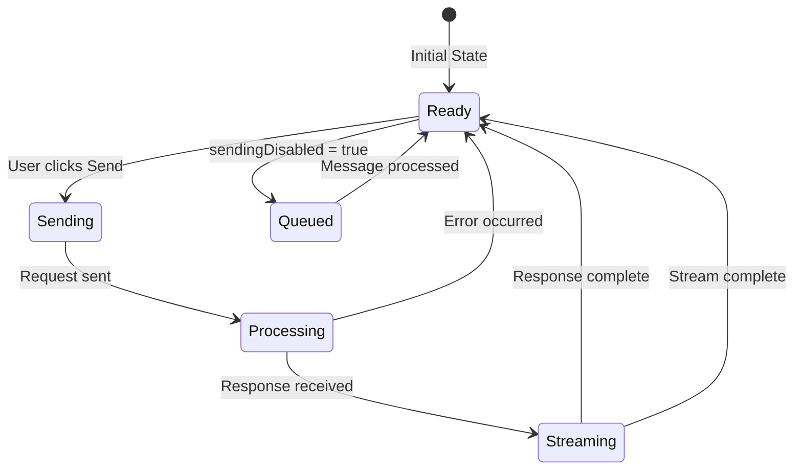
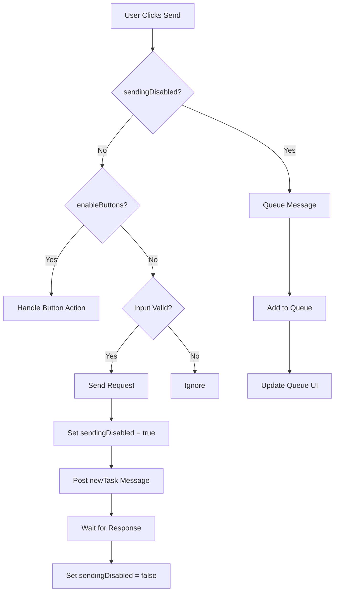

# UI Message Flow System

## Table of Contents

* [UI Message Flow System](#ui-message-flow-system)
* [Table of Contents](#table-of-contents)
* [When You're Here](#when-youre-here)
* [Research Context](#research-context)
* [Technical Overview](#technical-overview)
* [Background](#background)
* [Methodology](#methodology)
* [Overview](#overview)
* [System Architecture](#system-architecture)
* [Send Button State Management](#send-button-state-management)
* [Primary State Variables](#primary-state-variables)
* [State Transition Flow](#state-transition-flow)
* [Core State Logic](#core-state-logic)
* [Send Button Implementation](#send-button-implementation)
* [Message Queue Integration](#message-queue-integration)
* [Queue State Management](#queue-state-management)
* [Queue UI Component](#queue-ui-component)
* [Request Flow Control](#request-flow-control)
* [Flow Control Logic](#flow-control-logic)
* [Request Deduplication](#request-deduplication)
* [Troubleshooting Guide](#troubleshooting-guide)
* [Send Button Stuck in Disabled State](#send-button-stuck-in-disabled-state)
* [Multiple Messages Queued](#multiple-messages-queued)
* [Button State Inconsistency](#button-state-inconsistency)
* [Debugging Procedures](#debugging-procedures)
* [Enable Debug Logging](#enable-debug-logging)
* [State Inspection Tools](#state-inspection-tools)
* [Performance Monitoring](#performance-monitoring)
* [No Dead Ends Policy](#no-dead-ends-policy)
* [Navigation](#navigation)
* [Navigation](#navigation)
* [UI Message Flow System](#ui-message-flow-system)
* [Table of Contents](#table-of-contents)
* [When You're Here](#when-youre-here)
* [Research Context](#research-context)
* [Technical Overview](#technical-overview)
* [Background](#background)
* [Methodology](#methodology)
* [Overview](#overview)
* [System Architecture](#system-architecture)
* [Send Button State Management](#send-button-state-management)
* [Primary State Variables](#primary-state-variables)
* [State Transition Flow](#state-transition-flow)
* [Core State Logic](#core-state-logic)
* [Send Button Implementation](#send-button-implementation)
* [Message Queue Integration](#message-queue-integration)
* [Queue State Management](#queue-state-management)
* [Queue UI Component](#queue-ui-component)
* [Request Flow Control](#request-flow-control)
* [Flow Control Logic](#flow-control-logic)
* [Request Deduplication](#request-deduplication)
* [Troubleshooting Guide](#troubleshooting-guide)
* [Send Button Stuck in Disabled State](#send-button-stuck-in-disabled-state)
* [Multiple Messages Queued](#multiple-messages-queued)
* [Button State Inconsistency](#button-state-inconsistency)
* [Debugging Procedures](#debugging-procedures)
* [Enable Debug Logging](#enable-debug-logging)
* [State Inspection Tools](#state-inspection-tools)
* [Performance Monitoring](#performance-monitoring)
* [No Dead Ends Policy](#no-dead-ends-policy)
* [Navigation](#navigation)
* ↑ [Table of Contents](#table-of-contents)

## When You're Here

🔍 **Did You Know**: \[Interesting insight]

This document provides comprehensive coverage of KiloCode's message flow system, including send
button state management, message queuing, and request deduplication mechanisms.

* **Purpose**: Complete guide to message flow control and request management in the UI layer
* **Context**: Essential for developers working on message handling, state management, or debugging
  request flow issues
* **Navigation**: Use the table of contents below to jump to specific topics

## Research Context

### Technical Overview

**Component**: \[Component name]
**Version**: \[Version number]
**Architecture**: \[Architecture description]
**Dependencies**: \[Key dependencies]

### Background

\[Background information about the topic]

### Methodology

\[Research or development methodology used]

## Overview

The UI Message Flow System manages user interactions with the chat interface, including send button
state management, message queuing, and request deduplication mechanisms. This system is critical for
preventing duplicate API requests and maintaining a consistent user experience across all chat
interactions.

## System Architecture

The message flow system consists of interconnected components that work together to manage user
input and prevent duplicate requests:

1. **ChatView Component** - Main chat interface controller
2. **ChatTextArea Component** - Input area with send button
3. **Message Queue UI** - Visual representation of queued messages
4. **State Management** - Centralized state for request control

## Send Button State Management

### Primary State Variables

The send button state is controlled by several key variables in `ChatView.tsx`:

```typescript
const [sendingDisabled, setSendingDisabled] = useState(false)
const [enableButtons, setEnableButtons] = useState(false)
const [isStreaming, setIsStreaming] = useState(false)
const [inputValue, setInputValue] = useState("")
```

### State Transition Flow



### Core State Logic

```typescript
// In ChatView.tsx
const handleSendMessage = useCallback(
    (text: string, images: string[]) => {
        text = text.trim()

        if (text || images.length > 0) {
            if (sendingDisabled) {
                // Queue message instead of sending immediately
                try {
                    console.log("queueMessage", text, images)
                    vscode.postMessage({ type: "queueMessage", text, images })
                } catch (error) {
                    console.error("Failed to queue message:", error)
                }
            } else {
                // Send immediately
                vscode.postMessage({ type: "newTask", text, images })
            }
        }
    },
    [sendingDisabled],
)
```

### Send Button Implementation

```typescript
// In ChatTextArea.tsx
<button
  aria-label={t("chat:sendMessage")}
  disabled={sendingDisabled}
  onClick={!sendingDisabled ? onSend : undefined}
  className={cn(
    "relative inline-flex items-center justify-center",
    "bg-transparent border-none p-1.5",
    "border border-[rgba(255,255,255,0.08)] rounded-md",
    "hover:bg-[rgba(255,255,255,0.03)] hover:border-[rgba(255,255,255,0.15)]",
    "focus:outline-none focus-visible:ring-1 focus-visible:ring-vscode-focusBorder",
    "active:bg-[rgba(255,255,255,0.1)]",
    !sendingDisabled && "cursor-pointer",
    sendingDisabled &&
"opacity-40 cursor-not-allowed grayscale-[30%] hover:bg-transparent
hover:border-[rgba(255,255,255,0.08)] active:bg-transparent",
  )}
>
  <SendHorizontal className="w-4 h-4" />
</button>
```

## Message Queue Integration

### Queue State Management

The message queue UI integrates with the backend `MessageQueueService`:

```typescript
// Queue state updates
useEffect(() => {
    const currentTask = provider.getCurrentTask()
    if (currentTask?.messageQueueService) {
        const handleQueueStateChange = (messages: QueuedMessage[]) => {
            setQueuedMessages(messages)
        }

        currentTask.messageQueueService.on("stateChanged", handleQueueStateChange)

        return () => {
            currentTask.messageQueueService.off("stateChanged", handleQueueStateChange)
        }
    }
}, [provider])
```

### Queue UI Component

```typescript
// QueuedMessages component
export const QueuedMessages: React.FC<QueuedMessagesProps> = ({ messages, onRemove, onEdit }) => {
  if (messages.length === 0) return null

  return (
    <div className="queued-messages">
      {messages.map((message) => (
        <div key={message.id} className="queued-message">
          <span className="message-text">{message.text.substring(0, 50)}...</span>
          <button onClick={() => onRemove(message.id)}>Remove</button>
          <button onClick={() => onEdit(message.id)}>Edit</button>
        </div>
      ))}
    </div>
  )
}
```

## Request Flow Control

### Flow Control Logic

The system implements multiple layers of flow control to prevent duplicate requests:



### Request Deduplication

```typescript
// Request deduplication logic
const requestIds = new Set<string>()

const handleSendMessage = useCallback(
    (text: string, images: string[]) => {
        const requestSignature = `${text}-${JSON.stringify(images)}-${Date.now()}`

        if (requestIds.has(requestSignature)) {
            console.log("Duplicate request detected, skipping")
            return
        }

        requestIds.add(requestSignature)

        // Process request
        if (sendingDisabled) {
            vscode.postMessage({ type: "queueMessage", text, images })
        } else {
            vscode.postMessage({ type: "newTask", text, images })
        }

        // Clean up request ID after timeout
        setTimeout(() => {
            requestIds.delete(requestSignature)
        }, 5000)
    },
    [sendingDisabled],
)
```

## Troubleshooting Guide

### Send Button Stuck in Disabled State

**Symptoms**:

* Send button remains disabled after request completion
* User cannot send new messages
* UI appears frozen

**Root Cause**: `sendingDisabled` state not properly reset

**Solution**:

```typescript
// Ensure proper state reset
useEffect(() => {
    const currentTask = provider.getCurrentTask()
    if (currentTask) {
        const checkTaskState = () => {
            if (!currentTask.isStreaming && !currentTask.isWaitingForFirstChunk) {
                setSendingDisabled(false)
            }
        }

        // Check state periodically
        const interval = setInterval(checkTaskState, 1000)

        return () => clearInterval(interval)
    }
}, [provider])
```

### Multiple Messages Queued

**Symptoms**:

* Same message appears multiple times in queue
* Multiple API requests for single user action
* Queue UI shows duplicates

**Root Cause**: Message queued multiple times due to rapid user interaction

**Solution**:

```typescript
// Implement debounced message queuing
const debouncedQueueMessage = useMemo(
    () =>
        debounce((text: string, images: string[]) => {
            vscode.postMessage({ type: "queueMessage", text, images })
        }, 300),
    [],
)

const handleSendMessage = useCallback(
    (text: string, images: string[]) => {
        if (sendingDisabled) {
            debouncedQueueMessage(text, images)
        } else {
            vscode.postMessage({ type: "newTask", text, images })
        }
    },
    [sendingDisabled, debouncedQueueMessage],
)
```

### Button State Inconsistency

**Symptoms**:

* Button appears enabled but request is blocked
* Button appears disabled but request goes through
* Visual state doesn't match actual state

**Root Cause**: State updates not properly synchronized

**Solution**:

```typescript
// Implement state validation
const validateButtonState = useCallback(() => {
    const currentTask = provider.getCurrentTask()
const expectedSendingDisabled = currentTask?.isStreaming || currentTask?.isWaitingForFirstChunk ||
false

    if (sendingDisabled !== expectedSendingDisabled) {
        console.warn("Button state inconsistency detected, correcting")
        setSendingDisabled(expectedSendingDisabled)
    }
}, [sendingDisabled, provider])

// Validate state on task changes
useEffect(() => {
    validateButtonState()
}, [currentTask?.isStreaming, currentTask?.isWaitingForFirstChunk, validateButtonState])
```

## Debugging Procedures

### Enable Debug Logging

```typescript
// Add comprehensive logging
const debugLog = (message: string, data?: any) => {
    if (process.env.NODE_ENV === "development") {
        console.log(`[UI_DEBUG] ${message}`, data)
    }
}

// Log state changes
useEffect(() => {
    debugLog("State changed", {
        sendingDisabled,
        enableButtons,
        isStreaming: currentTask?.isStreaming,
        queuedMessagesCount: queuedMessages.length,
    })
}, [sendingDisabled, enableButtons, currentTask?.isStreaming, queuedMessages.length])
```

### State Inspection Tools

```typescript
// Add state inspection to window object for debugging
useEffect(() => {
    if (process.env.NODE_ENV === "development") {
        ;(window as any).inspectUIState = () => ({
            sendingDisabled,
            enableButtons,
            isStreaming: currentTask?.isStreaming,
queuedMessages: queuedMessages.map((m) => ({ id: m.id, text: m.text.substring(0, 50) })),
            inputValue: inputValue.substring(0, 50),
        })
    }
}, [sendingDisabled, enableButtons, currentTask?.isStreaming, queuedMessages, inputValue])
```

### Performance Monitoring

```typescript
// Monitor request patterns
const requestMonitor = {
    requests: new Map<string, number>(),

    trackRequest: (type: string) => {
        const count = this.requests.get(type) || 0
        this.requests.set(type, count + 1)

        if (count > 5) {
            console.warn(`High request count for ${type}: ${count}`)
        }
    },

    getStats: () => Object.fromEntries(this.requests),
}

// Track requests
const handleSendMessage = useCallback(
    (text: string, images: string[]) => {
        if (sendingDisabled) {
            requestMonitor.trackRequest("queued")
            vscode.postMessage({ type: "queueMessage", text, images })
        } else {
            requestMonitor.trackRequest("immediate")
            vscode.postMessage({ type: "newTask", text, images })
        }
    },
    [sendingDisabled],
)
```

## No Dead Ends Policy

This document connects to:

For more information, see:

* [Documentation Structure](../README.md)
* [Additional Resources](../tools/README.md)

## Navigation

* 📚 [Technical Glossary](../GLOSSARY.md)

## Navigation

* [← Back to UI Documentation](README.md)
* [→ UI Layer System](UI_LAYER_SYSTEM.md)
* [→ Chat Task Window](UI_CHAT_TASK_WINDOW.md)
