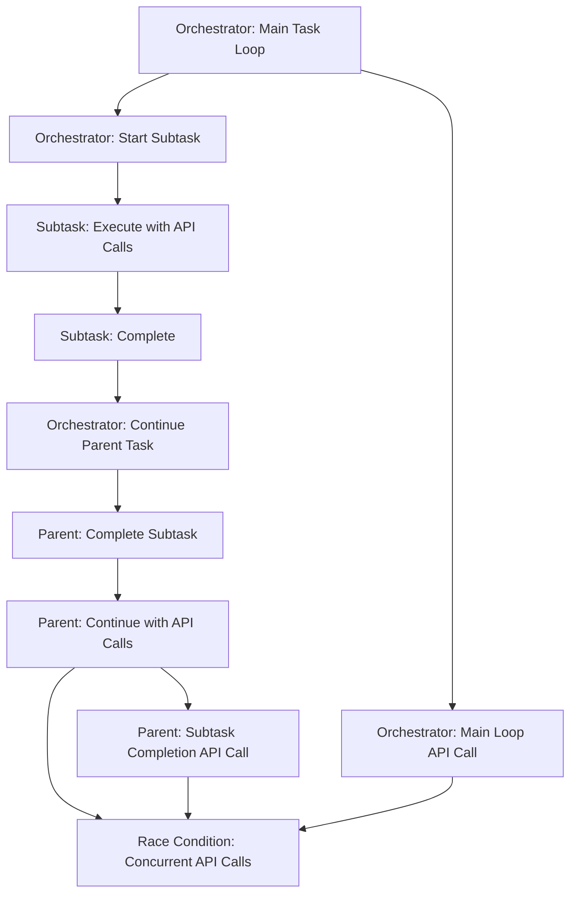

# API Request Duplication Investigation Plan

**Purpose:** Comprehensive plan to track down and resolve the issue where multiple API requests with spinners appear simultaneously in the chat view, particularly after subtask completion in the orchestrator.

**Status:** ACTIVE INVESTIGATION
**Created:** 2024-12-19
**Priority:** CRITICAL

<details><summary>Table of Contents</summary>

- [Executive Summary](#executive-summary)
- [Problem Description](#problem-description)
    - [Symptoms Observed](#symptoms-observed)
    - [Root Cause Identification Process](#root-cause-identification-process)
    - [Root Cause (UPDATED ANALYSIS)](#root-cause-updated-analysis)
    - [Async Concurrency Model](#async-concurrency-model)
- [Orchestrator-Subtask-Orchestrator Flow Analysis](#orchestrator-subtask-orchestrator-flow-analysis)
    - [Complete Flow Overview](#complete-flow-overview)
    - [Phase 1: Subtask Creation (Orchestrator → Subtask)](#phase-1-subtask-creation-orchestrator--subtask)
    - [Phase 2: Parent Task Waiting (Orchestrator Paused)](#phase-2-parent-task-waiting-orchestrator-paused)
    - [Phase 3: Subtask Execution (Subtask Context)](#phase-3-subtask-execution-subtask-context)
    - [Phase 4: Subtask Completion (Subtask → Orchestrator)](#phase-4-subtask-completion-subtask--orchestrator)
    - [Phase 5: Parent Task Resumption (Orchestrator Context)](#phase-5-parent-task-resumption-orchestrator-context)
    - [Phase 6: Subtask Result Integration (Parent Task Context)](#phase-6-subtask-result-integration-parent-task-context)
    - [Critical Race Condition Points](#critical-race-condition-points)
    - [Data Flow Summary](#data-flow-summary)
- [Root Cause Connection to Recent Changes](#root-cause-connection-to-recent-changes)
    - [What Changed](#what-changed)
    - [Why This Causes the Race Condition](#why-this-causes-the-race-condition)
    - [The Fix Connection](#the-fix-connection)
- [Proposed Fix](#proposed-fix)
    - [Root Cause Summary](#root-cause-summary)
    - [Proposed Solution: Recursive Call Synchronization](#proposed-solution-recursive-call-synchronization)
    - [Implementation 1: Simple Lock-Based Synchronization](#implementation-1-simple-lock-based-synchronization)
    - [Implementation 2: Enhanced Synchronization with Call Tracking](#implementation-2-enhanced-synchronization-with-call-tracking)
    - [Alternative Solution: Subtask Completion Coordination](#alternative-solution-subtask-completion-coordination)
    - [Recommended Implementation Approach](#recommended-implementation-approach)
    - [Testing Strategy](#testing-strategy)
    - [Rollback Plan](#rollback-plan)
- [Investigation Strategy](#investigation-strategy)
    - [Phase 1: Concurrent Call Detection (IMMEDIATE)](#phase-1-concurrent-call-detection-immediate)
    - [Phase 2: Race Condition Verification (IMMEDIATE)](#phase-2-race-condition-verification-immediate)
    - [Phase 3: Synchronization Implementation (WEEK 1)](#phase-3-synchronization-implementation-week-1)
    - [Phase 4: Testing and Validation (WEEK 2)](#phase-4-testing-and-validation-week-2)
    - [Phase 5: Production Deployment (WEEK 3)](#phase-5-production-deployment-week-3)
- [Implementation Timeline](#implementation-timeline)
- [Success Criteria](#success-criteria)
- [Risk Mitigation](#risk-mitigation)
- [Documentation Updates](#documentation-updates)
- [Monitoring and Alerting](#monitoring-and-alerting)
- [Conclusion](#conclusion)

</details>

## Executive Summary

## Research Context

**Purpose:** [Describe the purpose and scope of this document]

**Background:** [Provide relevant background information]

**Research Questions:** [List key questions this document addresses]

**Methodology:** [Describe the approach or methodology used]

**Findings:** [Summarize key findings or conclusions]

---

Based on analysis of the reported symptoms (mid-turn API duplication without queued messages), the root cause has been identified as a **concurrent recursive calls race condition** where the main task loop and subtask completion both call `recursivelyMakeClineRequests` simultaneously, each making their own API request. This plan provides a systematic approach to:

1. **Confirm the root cause** through extensive debug logging
2. **Implement comprehensive monitoring** to track concurrent calls
3. **Add synchronization** to prevent concurrent recursive calls
4. **Create reproducible test cases** for validation
5. **Implement permanent fixes** with proper coordination

## Problem Description

### Symptoms Observed

- Multiple API requests with spinners appearing simultaneously
- Responses coming back jumbled and confusing the chat interface
- Occurs in the middle of a turn after many back-and-forth interactions
- Particularly noticeable after subtask completion in orchestrator
- **NOT related to queued messages** - happens during active processing
- **NOT related to user input** - happens during system processing

### Root Cause Identification Process

**How We Identified the Root Cause:**

1. **Symptom Analysis**: You reported the issue occurs "in the middle of a turn after many back and forths" and "without any queued messages"
2. **Code Analysis**: Searched for all places where `recursivelyMakeClineRequests` is called
3. **Pattern Recognition**: Found two key call sites:
    - Main task loop: `await this.recursivelyMakeClineRequests(nextUserContent, includeFileDetails)` (Task.ts:1760)
    - Subtask completion: `await parentTask.recursivelyMakeClineRequests([], false)` (ClineProvider.ts:1587)
    - **Context**: The subtask completion call happens in the **orchestrator context** (ClineProvider), not within the subtask itself
4. **Race Condition Hypothesis**: Both calls can run concurrently, each making their own API request
5. **API Call Location**: Both paths lead to `this.api.createMessage` (Task.ts:2984)

### Root Cause (UPDATED ANALYSIS)

**Concurrent Recursive Calls Race Condition:**

- **Main task loop** calls `recursivelyMakeClineRequests` (Task.ts:1760) - runs in the **orchestrator context**
- **Subtask completion** calls `parentTask.recursivelyMakeClineRequests([], false)` (ClineProvider.ts:1587) - also runs in the **orchestrator context**
- **Key insight**: Both calls happen in the **orchestrator context**, not within the subtask itself
- The orchestrator calls `parentTask.completeSubtask()` which unpauses the parent task, then immediately calls `parentTask.recursivelyMakeClineRequests()`
- **Threading model**: This is **all async code running in a single Node.js thread** - no separate threads
- The concurrency comes from **async/await scheduling** and **event loop interleaving**
- Both calls can run concurrently after many back-and-forths due to async scheduling
- Each call makes its own API request via `this.api.createMessage`
- Result: Multiple API calls for the same processing turn

### Async Concurrency Model

**How the Race Condition Occurs in Single-Threaded Node.js:**

1. **Single Thread**: All code runs in one Node.js thread (Node.js 20.19.2)
2. **Event Loop**: Node.js uses an event loop to handle async operations
3. **Async Scheduling**: When `await` is encountered, the function yields control back to the event loop
4. **Interleaving**: Other async operations can run while waiting for I/O (like API calls)
5. **Race Condition**: Two async functions can both reach the API call point before either completes

**Example Timeline:**

```
Time 1: Main task loop calls recursivelyMakeClineRequests() → hits await api.createMessage()
Time 2: Function yields to event loop, API call starts
Time 3: Subtask completes, calls parentTask.recursivelyMakeClineRequests() → hits await api.createMessage()
Time 4: Second API call starts before first completes
Time 5: Both API calls are now in flight simultaneously
```

### Verification Strategy

**How to Verify the Root Cause:**

1. **Add Logging**: Implement the logging in Phase 1 to detect concurrent calls
2. **Look for Patterns**: Search logs for `[CONCURRENT_RECURSIVE_CALLS_DETECTED]` warnings
3. **Timing Analysis**: Check if API calls happen within milliseconds of each other
4. **Call Stack Analysis**: Verify that one call comes from main loop and another from subtask completion
5. **Reproduction**: Create test scenarios that trigger subtask completion during active processing

## Orchestrator-Subtask-Orchestrator Flow Analysis

**Purpose:** Detailed analysis of how the orchestrator creates subtasks, manages their execution, and resumes parent tasks, including the complete data flow and transition points where race conditions can occur.

### Complete Flow Overview

The orchestrator-subtask-orchestrator transition follows this sequence:

1. **Orchestrator creates subtask** → **Subtask executes** → **Subtask completes** → **Orchestrator resumes parent**
2. **Data flows** through conversation history, task state, and API calls
3. **Race conditions** occur at the transition points where both orchestrator and subtask completion can trigger API calls

### Phase 1: Subtask Creation (Orchestrator → Subtask)

**Location:** [`/src/core/task/Task.ts:1650-1671`](/src/core/task/Task.ts#L1650)

```typescript
public async startSubtask(message: string, initialTodos: TodoItem[], mode: string) {
    const provider = this.providerRef.deref()
    const newTask = await provider.createTask(message, undefined, this, { initialTodos })

    if (newTask) {
        this.isPaused = true // Pause parent
        this.childTaskId = newTask.taskId
        await provider.handleModeSwitch(mode) // Set child's mode
        await delay(500) // Allow mode change to take effect
        this.emit(RooCodeEventName.TaskPaused, this.taskId)
        this.emit(RooCodeEventName.TaskSpawned, newTask.taskId)
    }
    return newTask
}
```

**Data Flow:**

- **Parent task state**: `isPaused = true`, `childTaskId = newTask.taskId`
- **Task stack**: New subtask added to orchestrator's task stack
- **Mode switching**: Child task gets different mode (e.g., "subtask" mode)
- **Event emission**: Parent task paused, subtask spawned

### Phase 2: Parent Task Waiting (Orchestrator Paused)

**Location:** [`/src/core/task/Task.ts:1676-1685`](/src/core/task/Task.ts#L1676)

```typescript
public async waitForSubtask() {
    await new Promise<void>((resolve) => {
        this.pauseInterval = setInterval(() => {
            if (!this.isPaused) {
                clearInterval(this.pauseInterval)
                this.pauseInterval = undefined
                resolve()
            }
        }, 1000)
    })
}
```

**Data Flow:**

- **Parent task**: Paused state maintained via `isPaused = true`
- **Polling mechanism**: Checks every 1000ms for unpause signal
- **No API calls**: Parent task is completely paused during subtask execution

### Phase 3: Subtask Execution (Subtask Context)

**Location:** [`/src/core/task/Task.ts:1758-1780`](/src/core/task/Task.ts#L1758)

```typescript
await Laminar.withSpan(laminarService.getActiveSpan("DEFAULT")!, async () => {
	while (!this.abort) {
		const didEndLoop = await this.recursivelyMakeClineRequests(nextUserContent, includeFileDetails)
		// ... subtask processing logic
	}
})
```

**Data Flow:**

- **Independent execution**: Subtask runs its own `recursivelyMakeClineRequests` loop
- **API calls**: Subtask makes its own API calls via `this.api.createMessage`
- **Conversation history**: Subtask maintains separate conversation history
- **Mode-specific behavior**: Subtask operates in "subtask" mode with different tools/behavior

### Phase 4: Subtask Completion (Subtask → Orchestrator)

**Location:** [`/src/core/webview/ClineProvider.ts:466-473`](/src/core/webview/ClineProvider.ts#L466)

```typescript
async finishSubTask(lastMessage: string) {
    // Remove the last cline instance from the stack (this is the finished subtask)
    await this.removeClineFromStack()
    // Resume the last cline instance in the stack (if it exists - this is the 'parent' calling task)
    await this.continueParentTask(lastMessage)
}
```

**Data Flow:**

- **Task stack management**: Subtask removed from orchestrator's task stack
- **Parent task retrieval**: Orchestrator gets reference to parent task
- **Completion message**: `lastMessage` contains subtask's final result
- **Transition trigger**: Calls `continueParentTask` to resume parent

### Phase 5: Parent Task Resumption (Orchestrator Context)

**Location:** [`/src/core/webview/ClineProvider.ts:1550-1610`](/src/core/webview/ClineProvider.ts#L1550)

```typescript
private async continueParentTask(lastMessage: string): Promise<void> {
    const parentTask = this.getCurrentTask()

    // Initialize parent task if needed
    if (!parentTask.isInitialized) {
        parentTask.clineMessages = await parentTask.getSavedClineMessages()
        parentTask.apiConversationHistory = await parentTask.getSavedApiConversationHistory()
        parentTask.isInitialized = true
    }

    // Complete the subtask on the parent task
    await parentTask.completeSubtask(lastMessage)

    // Continue parent task execution if unpaused and initialized
    if (!parentTask.isPaused && parentTask.isInitialized) {
        const continueExecution = async () => {
            await parentTask.recursivelyMakeClineRequests([], false)
        }
        continueExecution() // Start in background
    }
}
```

**Data Flow:**

- **Parent task initialization**: Loads saved messages and conversation history
- **Subtask completion**: Calls `parentTask.completeSubtask(lastMessage)`
- **State restoration**: Parent task unpaused, child task ID cleared
- **Execution continuation**: Calls `recursivelyMakeClineRequests([], false)`

### Phase 6: Subtask Result Integration (Parent Task Context)

**Location:** [`/src/core/task/Task.ts:1688-1715`](/src/core/task/Task.ts#L1688)

```typescript
public async completeSubtask(lastMessage: string) {
    this.isPaused = false
    this.childTaskId = undefined
    this.emit(RooCodeEventName.TaskUnpaused, this.taskId)

    // Add subtask result to conversation
    await this.say("subtask_result", lastMessage)
    await this.addToApiConversationHistory({
        role: "user",
        content: [{ type: "text", text: `[new_task completed] Result: ${lastMessage}` }]
    })

    // Ensure next API call includes full conversation
    this.skipPrevResponseIdOnce = true
}
```

**Data Flow:**

- **State updates**: `isPaused = false`, `childTaskId = undefined`
- **Conversation integration**: Subtask result added to parent's conversation history
- **UI updates**: Subtask result displayed in chat interface
- **API preparation**: `skipPrevResponseIdOnce = true` ensures full conversation sent

### Critical Race Condition Points

**Race Condition 1: Concurrent API Calls**

- **Location**: Both `recursivelyMakeClineRequests` calls can run simultaneously
- **Trigger**: Main task loop + subtask completion both call the same method
- **Timing**: After many back-and-forths, both calls can reach API call point

**Race Condition 2: State Inconsistency**

- **Location**: Parent task state changes during subtask completion
- **Trigger**: `completeSubtask()` modifies state while main loop may be running
- **Timing**: State changes can occur between API call preparation and execution

**Race Condition 3: Conversation History Conflicts**

- **Location**: Both calls access and modify conversation history
- **Trigger**: Main loop and subtask completion both read/write conversation data
- **Timing**: Conversation updates can occur between API call preparation and execution

### Data Flow Summary



**Key Insight**: The race condition occurs because both the main task loop and subtask completion can trigger `recursivelyMakeClineRequests` simultaneously, each making their own API call to the same conversation context.

## Root Cause Connection to Recent Changes

**Important Discovery**: The API duplication issue is likely caused by recent changes in the `catrielmuller/orchestator-load-subtask` branch, specifically commit `749f3d22a` from September 10, 2025.

### What Changed

**Before the change** (original code):

```typescript
async finishSubTask(lastMessage: string) {
    await this.removeClineFromStack()
    await this.getCurrentTask()?.completeSubtask(lastMessage)
}
```

**After the change** (current code):

```typescript
async finishSubTask(lastMessage: string) {
    await this.removeClineFromStack()
    await this.continueParentTask(lastMessage) // kilocode_change
}

private async continueParentTask(lastMessage: string): Promise<void> {
    // ... initialization logic ...
    await parentTask.completeSubtask(lastMessage)

    if (!parentTask.isPaused && parentTask.isInitialized) {
        const continueExecution = async () => {
            await parentTask.recursivelyMakeClineRequests([], false) // RACE CONDITION HERE
        }
        continueExecution() // Start in background
    }
}
```

### Why This Causes the Race Condition

1. **Original behavior**: Only called `completeSubtask()` which added the result to conversation
2. **New behavior**: Calls `completeSubtask()` AND then calls `recursivelyMakeClineRequests([], false)`
3. **Race condition**: The new `recursivelyMakeClineRequests` call can run concurrently with the main task loop
4. **Result**: Two simultaneous API calls - one from main loop, one from subtask completion

### The Fix Connection

The proposed synchronization fix directly addresses this issue by ensuring only one `recursivelyMakeClineRequests` call can execute at a time, preventing the race condition introduced by this change.

### Why This Change Was Made (Analysis)

**The Original Problem Being Solved:**

The commit message "fix children task loading to continue the execution of the parent after finished" reveals the intended purpose. This change was designed to solve a **task resumption problem** when loading subtasks from history.

**The Scenario:**

1. **Orchestrator creates subtask** → **Subtask executes** → **Subtask completes** → **User navigates away**
2. **Later, user clicks on the subtask in history** to view it
3. **Problem**: The parent orchestrator task was not properly resumed/continued after the subtask finished

**What the Change Tried to Fix:**

The new `continueParentTask` method was designed to:

1. **Reconstruct the task stack** when loading a subtask from history
2. **Ensure parent tasks are properly initialized** with their conversation history
3. **Continue parent execution** after subtask completion, even when loaded from history

**The Key Insight - Why the Recursive Call Was Added:**

```typescript
// The problematic code that was added:
if (!parentTask.isPaused && parentTask.isInitialized) {
	const continueExecution = async () => {
		// This was added to "continue the execution of the parent after finished"
		await parentTask.recursivelyMakeClineRequests([], false)
	}
	continueExecution() // Start in background
}
```

**The Intent:** When a subtask finishes, the parent orchestrator should continue its execution loop to process the subtask result and potentially create more subtasks.

**The Unintended Consequence:** This creates a race condition because:

1. **Main task loop** is already running and calling `recursivelyMakeClineRequests`
2. **Subtask completion** also calls `recursivelyMakeClineRequests`
3. **Both calls happen simultaneously** in the same async context

**Why This Wasn't Caught:**

- The change was focused on **task loading from history** scenarios
- The race condition only occurs during **active task execution** (not history loading)
- The timing is very specific - it happens "after many back and forths" when both the main loop and subtask completion are active
- The change was tested for **history reconstruction** but not for **concurrent execution** scenarios

**The Real Solution:**
The change was well-intentioned but needs synchronization to prevent the race condition. The proposed fix addresses this by ensuring only one `recursivelyMakeClineRequests` call can execute at a time, preserving the intended functionality while preventing the duplication issue.

## Proposed Fix

**Purpose:** Specific implementation solution to prevent concurrent recursive calls and eliminate the API duplication race condition.

### Root Cause Summary

The issue occurs when:

1. **Main task loop** calls `recursivelyMakeClineRequests()` (Task.ts:1760)
2. **Subtask completion** calls `parentTask.recursivelyMakeClineRequests([], false)` (ClineProvider.ts:1587)
3. **Both calls run concurrently** in the same Node.js thread due to async/await scheduling
4. **Each makes its own API call** via `this.api.createMessage` (Task.ts:2984)
5. **Result**: Multiple simultaneous API requests with spinners

### Proposed Solution: Recursive Call Synchronization

**Strategy**: Add a synchronization mechanism to ensure only one `recursivelyMakeClineRequests` call can execute at a time per task instance.

#### Implementation 1: Simple Lock-Based Synchronization

**Location**: [`/src/core/task/Task.ts`](/src/core/task/Task.ts)

```typescript
// Add to Task class
private _recursiveCallLock = false
private _recursiveCallQueue: Array<() => Promise<void>> = []

public async recursivelyMakeClineRequests(
    userContent: Anthropic.Messages.ContentBlockParam[],
    includeFileDetails: boolean = false,
): Promise<boolean> {
    // If already running, queue this call
    if (this._recursiveCallLock) {
        console.log("[RECURSIVE_CALL_QUEUED]", {
            taskId: this.taskId,
            userContentLength: userContent.length,
            includeFileDetails,
            timestamp: Date.now()
        })

        return new Promise((resolve) => {
            this._recursiveCallQueue.push(async () => {
                const result = await this._executeRecursiveCall(userContent, includeFileDetails)
                resolve(result)
            })
        })
    }

    // Acquire lock and execute
    this._recursiveCallLock = true
    try {
        const result = await this._executeRecursiveCall(userContent, includeFileDetails)
        return result
    } finally {
        this._recursiveCallLock = false
        this._processQueue()
    }
}

private async _executeRecursiveCall(
    userContent: Anthropic.Messages.ContentBlockParam[],
    includeFileDetails: boolean = false,
): Promise<boolean> {
    // Move all existing logic here
    // ... existing recursivelyMakeClineRequests implementation
}

private async _processQueue(): Promise<void> {
    if (this._recursiveCallQueue.length > 0) {
        const nextCall = this._recursiveCallQueue.shift()
        if (nextCall) {
            // Process next call in queue
            setImmediate(() => nextCall())
        }
    }
}
```

#### Implementation 2: Enhanced Synchronization with Call Tracking

**Location**: [`/src/core/task/Task.ts`](/src/core/task/Task.ts)

```typescript
// Add to Task class
private _recursiveCallLock = false
private _activeRecursiveCalls = new Set<string>()
private _recursiveCallCounter = 0

public async recursivelyMakeClineRequests(
    userContent: Anthropic.Messages.ContentBlockParam[],
    includeFileDetails: boolean = false,
): Promise<boolean> {
    const callId = `recursive_${++this._recursiveCallCounter}_${Date.now()}`

    // Wait for lock with timeout
    const lockAcquired = await this._acquireLock(callId, 5000) // 5 second timeout
    if (!lockAcquired) {
        console.warn("[RECURSIVE_CALL_TIMEOUT]", {
            callId,
            taskId: this.taskId,
            timestamp: Date.now()
        })
        return false
    }

    try {
        this._activeRecursiveCalls.add(callId)

        console.log("[RECURSIVE_CALL_START]", {
            callId,
            taskId: this.taskId,
            userContentLength: userContent.length,
            includeFileDetails,
            timestamp: Date.now()
        })

        // Execute the actual logic
        const result = await this._executeRecursiveCall(userContent, includeFileDetails)

        console.log("[RECURSIVE_CALL_END]", {
            callId,
            taskId: this.taskId,
            result,
            timestamp: Date.now()
        })

        return result
    } finally {
        this._activeRecursiveCalls.delete(callId)
        this._recursiveCallLock = false
    }
}

private async _acquireLock(callId: string, timeoutMs: number): Promise<boolean> {
    const startTime = Date.now()

    while (this._recursiveCallLock) {
        if (Date.now() - startTime > timeoutMs) {
            return false
        }

        console.log("[RECURSIVE_CALL_WAITING]", {
            callId,
            taskId: this.taskId,
            waitTime: Date.now() - startTime,
            timestamp: Date.now()
        })

        await new Promise(resolve => setTimeout(resolve, 10))
    }

    this._recursiveCallLock = true
    return true
}
```

### Alternative Solution: Subtask Completion Coordination

**Strategy**: Modify subtask completion to check if main task loop is already running before calling `recursivelyMakeClineRequests`.

**Location**: [`/src/core/webview/ClineProvider.ts:1583-1595`](/src/core/webview/ClineProvider.ts#L1583)

```typescript
// Modified continueParentTask method
if (!parentTask.isPaused && parentTask.isInitialized) {
	// Check if main task loop is already running
	if (parentTask._recursiveCallLock || parentTask._activeRecursiveCalls?.size > 0) {
		console.log("[SUBTASK_COMPLETION_SKIPPED]", {
			parentTaskId: parentTask.taskId,
			reason: "Main task loop already running",
			timestamp: Date.now(),
		})
		// Skip the recursive call - main loop will handle continuation
		return
	}

	console.log("[SUBTASK_COMPLETION_CONTINUING]", {
		parentTaskId: parentTask.taskId,
		timestamp: Date.now(),
	})

	const continueExecution = async () => {
		try {
			await parentTask.recursivelyMakeClineRequests([], false)
		} catch (error) {
			this.log(`[continueParentTask] Error continuing parent task execution: ${error}`)
		}
	}
	continueExecution()
}
```

### Recommended Implementation Approach

**Phase 1**: Implement **Simple Lock-Based Synchronization** (Implementation 1)

- **Pros**: Simple, effective, minimal code changes
- **Cons**: Queued calls may have slight delay
- **Risk**: Low - straightforward synchronization

**Phase 2**: Add **Enhanced Synchronization** (Implementation 2) if needed

- **Pros**: Better monitoring, timeout handling, call tracking
- **Cons**: More complex, additional state management
- **Risk**: Medium - more complex state management

**Phase 3**: Consider **Subtask Completion Coordination** (Alternative Solution)

- **Pros**: Prevents unnecessary calls, more efficient
- **Cons**: Requires coordination between orchestrator and task
- **Risk**: Medium - requires careful coordination

### Testing Strategy

1. **Unit Tests**: Test lock acquisition, queue processing, timeout handling
2. **Integration Tests**: Test subtask completion with active main loop
3. **Load Tests**: Test with multiple concurrent subtasks
4. **Race Condition Tests**: Deliberately trigger race conditions to verify fixes

### Rollback Plan

If the fix causes issues:

1. **Immediate**: Revert to original code
2. **Fallback**: Implement only the subtask completion coordination
3. **Monitoring**: Add extensive logging to identify any new issues

## Investigation Strategy

### Phase 1: Concurrent Call Detection (IMMEDIATE)

#### 1.1 Recursive Call Tracking

**Location:** `src/core/task/Task.ts`

Add comprehensive logging to detect concurrent recursive calls:

```typescript
// Add to Task.ts class
private _activeRecursiveCalls = new Set<string>()
private _recursiveCallCounter = 0

public async recursivelyMakeClineRequests(
    userContent: Anthropic.Messages.ContentBlockParam[],
    includeFileDetails: boolean = false,
): Promise<boolean> {
    const callId = `recursive_${++this._recursiveCallCounter}_${Date.now()}`
    this._activeRecursiveCalls.add(callId)

    console.log("[RECURSIVE_CALL_START]", {
        callId,
        taskId: this.taskId,
        activeCalls: this._activeRecursiveCalls.size,
        userContentLength: userContent.length,
        includeFileDetails,
        isStreaming: this.isStreaming,
        timestamp: Date.now()
    })

    // Check for concurrent calls
    if (this._activeRecursiveCalls.size > 1) {
        console.warn("[CONCURRENT_RECURSIVE_CALLS_DETECTED]", {
            callId,
            activeCalls: Array.from(this._activeRecursiveCalls),
            taskId: this.taskId,
            timestamp: Date.now()
        })
    }

    try {
        // ... existing method logic
    } finally {
        this._activeRecursiveCalls.delete(callId)
        console.log("[RECURSIVE_CALL_END]", {
            callId,
            remainingCalls: this._activeRecursiveCalls.size,
            taskId: this.taskId
        })
    }
}
```

#### 1.2 API Call Tracking

**Location:** `src/core/task/Task.ts` (around line 2984)

Add logging to track API calls and detect duplicates:

```typescript
// Add before the API call in recursivelyMakeClineRequests
const apiCallId = `api_${callId}_${Date.now()}`
console.log("[API_CALL_START]", {
	apiCallId,
	callId,
	taskId: this.taskId,
	activeRecursiveCalls: this._activeRecursiveCalls.size,
	systemPromptLength: systemPrompt.length,
	conversationHistoryLength: cleanConversationHistory.length,
	timestamp: Date.now(),
})

return this.api.createMessage(systemPrompt, cleanConversationHistory, metadata)
```

#### 1.3 Subtask Completion Tracking

**Location:** `src/core/webview/ClineProvider.ts` (around line 1587)

Add logging to track subtask completion calls:

```typescript
// Add before the recursive call in continueParentTask
console.log("[SUBTASK_COMPLETION_RECURSIVE_CALL]", {
	parentTaskId: parentTask.taskId,
	subtaskId: subtaskId,
	activeRecursiveCalls: parentTask._activeRecursiveCalls?.size || 0,
	isStreaming: parentTask.isStreaming,
	timestamp: Date.now(),
})

await parentTask.recursivelyMakeClineRequests([], false)
```

#### 1.4 Synchronization Implementation

**Location:** `src/core/task/Task.ts`

Add synchronization to prevent concurrent recursive calls:

```typescript
// Add to Task class
private _recursiveCallLock = false

public async recursivelyMakeClineRequests(
    userContent: Anthropic.Messages.ContentBlockParam[],
    includeFileDetails: boolean = false,
): Promise<boolean> {
    // Wait for any existing call to complete
    while (this._recursiveCallLock) {
        console.log("[RECURSIVE_CALL_WAITING]", {
            taskId: this.taskId,
            activeCalls: this._activeRecursiveCalls.size,
            timestamp: Date.now()
        })
        await new Promise(resolve => setTimeout(resolve, 10))
    }

    this._recursiveCallLock = true
    const callId = `recursive_${++this._recursiveCallCounter}_${Date.now()}`
    this._activeRecursiveCalls.add(callId)

    try {
        // ... existing method logic
    } finally {
        this._recursiveCallLock = false
        this._activeRecursiveCalls.delete(callId)
    }
}
```

#### 1.5 Verification Steps

**What to Look For in Logs:**

1. **Concurrent Call Detection:**

    ```
    [CONCURRENT_RECURSIVE_CALLS_DETECTED] {
      callId: "recursive_2_1234567890",
      activeCalls: ["recursive_1_1234567889", "recursive_2_1234567890"],
      taskId: "task_123",
      timestamp: 1234567890
    }
    ```

2. **API Call Timing:**

    ```
    [API_CALL_START] { apiCallId: "api_recursive_1_1234567889", ... }
    [API_CALL_START] { apiCallId: "api_recursive_2_1234567890", ... }  // Within 100ms
    ```

3. **Subtask Completion Trigger:**
    ```
    [SUBTASK_COMPLETION_RECURSIVE_CALL] {
      parentTaskId: "task_123",
      subtaskId: "subtask_456",
      activeRecursiveCalls: 1,  // Should be > 0 when this happens
      isStreaming: true
    }
    ```

**Verification Criteria:**

- [ ] `[CONCURRENT_RECURSIVE_CALLS_DETECTED]` appears in logs
- [ ] Multiple `[API_CALL_START]` events within 100ms of each other
- [ ] `[SUBTASK_COMPLETION_RECURSIVE_CALL]` appears when `activeRecursiveCalls > 0`
- [ ] API calls have different `callId` values but same `taskId`

**Reproduction Test Case:**

```typescript
// Create a test that reproduces the race condition
describe("API Duplication Race Condition", () => {
	it("should reproduce concurrent recursive calls", async () => {
		const task = new Task(/* ... */)

		// Start main task loop
		const mainLoop = task.recursivelyMakeClineRequests([{ type: "text", text: "main task" }], false)

		// Simulate subtask completion while main loop is running
		setTimeout(() => {
			task.recursivelyMakeClineRequests([], false) // This should trigger the race condition
		}, 50)

		await mainLoop

		// Verify concurrent calls were detected
		expect(concurrentCallDetected).toBe(true)
		expect(apiCallCount).toBe(2) // Should have made 2 API calls
	})
})
```

### Phase 2: UI State Monitoring (IMMEDIATE)

#### 2.1 Chat UI State Tracking

**Location:** `webview-ui/src/components/chat/ChatView.tsx`

Add comprehensive state monitoring:

```typescript
// Add to ChatView component
const [debugState, setDebugState] = useState({
	sendingDisabled: false,
	isStreaming: false,
	enableButtons: false,
	activeRequests: 0,
	queuedMessages: 0,
	lastStateChange: Date.now(),
})

// Add state change logging
useEffect(() => {
	console.log("[UI_STATE_CHANGE]", {
		sendingDisabled,
		isStreaming,
		enableButtons,
		activeRequests: debugState.activeRequests,
		queuedMessages: debugState.queuedMessages,
		timestamp: Date.now(),
	})

	setDebugState((prev) => ({
		...prev,
		sendingDisabled,
		isStreaming,
		enableButtons,
		lastStateChange: Date.now(),
	}))
}, [sendingDisabled, isStreaming, enableButtons])

// Add request tracking to handleSendMessage
const handleSendMessage = useCallback(
	(text: string, images: string[]) => {
		const requestId = `ui_${Date.now()}_${Math.random().toString(36).substr(2, 9)}`

		console.log("[UI_SEND_MESSAGE]", {
			requestId,
			text: text.substring(0, 50),
			sendingDisabled,
			isStreaming,
			enableButtons,
			timestamp: Date.now(),
		})

		if (sendingDisabled) {
			console.log("[UI_SEND_MESSAGE] Queuing message due to sendingDisabled")
			vscode.postMessage({ type: "queueMessage", text, images })
		} else {
			console.log("[UI_SEND_MESSAGE] Sending immediately")
			vscode.postMessage({ type: "newTask", text, images })
		}
	},
	[sendingDisabled, isStreaming, enableButtons],
)
```

#### 2.2 Webview Message Handler Instrumentation

**Location:** `src/core/webview/webviewMessageHandler.ts`

Add message tracking:

```typescript
// Add to webviewMessageHandler function
const logMessage = (type: string, data: any) => {
  console.log("[WEBVIEW_MESSAGE]", {
    type,
    data: typeof data === 'string' ? data.substring(0, 100) : data,
    timestamp: Date.now(),
    currentTaskId: provider.getCurrentTask()?.taskId
  })
}

// Instrument key message handlers
case "newTask": {
  logMessage("newTask", { text: message.text?.substring(0, 50), images: message.images?.length })
  // ... existing code
}

case "queueMessage": {
  logMessage("queueMessage", { text: message.text?.substring(0, 50), images: message.images?.length })
  provider.getCurrentTask()?.messageQueueService.addMessage(message.text ?? "", message.images)
  break
}
```

### Phase 3: Orchestrator Subtask Monitoring (IMMEDIATE)

#### 3.1 Subtask Completion Tracking

**Location:** `src/core/task/Task.ts` - `completeSubtask` method

Add comprehensive subtask completion logging:

```typescript
// Add to completeSubtask method
public completeSubtask(result: string): void {
  const subtaskId = this.currentSubtaskId
  console.log("[SUBTASK_COMPLETION]", {
    subtaskId,
    resultLength: result.length,
    parentTaskId: this.taskId,
    queueSize: this.messageQueueService.messages.length,
    activeRequests: this._activeRequests.size,
    timestamp: Date.now()
  })

  // ... existing completion logic ...

  console.log("[SUBTASK_COMPLETION] Completed", {
    subtaskId,
    parentTaskId: this.taskId,
    willProcessQueue: !this.messageQueueService.isEmpty()
  })
}
```

#### 3.2 Tool Completion Instrumentation

**Location:** All tool files that call `processQueuedMessages()`

Add standardized logging to all tools:

```typescript
// Create a helper function in a shared location
export const logToolCompletion = (toolName: string, cline: any) => {
	console.log("[TOOL_COMPLETION]", {
		toolName,
		taskId: cline.taskId,
		queueSize: cline.messageQueueService?.messages?.length || 0,
		willProcessQueue: !cline.messageQueueService?.isEmpty(),
		timestamp: Date.now(),
	})
}

// Use in all tools before processQueuedMessages()
logToolCompletion("apply_diff", cline)
cline.processQueuedMessages()
```

### Phase 4: API Provider Request Tracking (IMMEDIATE)

#### 4.1 Provider-Level Request Instrumentation

**Location:** `src/api/providers/` - All provider files

Add request tracking to all providers:

```typescript
// Add to each provider's createMessage method
private static _requestCounter = 0
private static _activeRequests = new Map<string, RequestInfo>()

interface RequestInfo {
  id: string
  provider: string
  timestamp: number
  taskId?: string
  model: string
}

private static logProviderRequest(provider: string, taskId: string, model: string) {
  const requestId = `${provider}_${++this._requestCounter}_${Date.now()}`

  this._activeRequests.set(requestId, {
    id: requestId,
    provider,
    timestamp: Date.now(),
    taskId,
    model
  })

  console.log("[PROVIDER_REQUEST]", {
    requestId,
    provider,
    taskId,
    model,
    activeProviderRequests: this._activeRequests.size
  })

  return requestId
}

private static logProviderResponse(requestId: string, success: boolean) {
  const request = this._activeRequests.get(requestId)
  if (request) {
    console.log("[PROVIDER_RESPONSE]", {
      requestId,
      provider: request.provider,
      success,
      duration: Date.now() - request.timestamp
    })
    this._activeRequests.delete(requestId)
  }
}
```

### Phase 5: Race Condition Detection (IMMEDIATE)

#### 5.1 Global Race Condition Monitor

**Location:** `src/core/task/Task.ts`

Add a global monitor for detecting race conditions:

```typescript
// Add to Task class
private _raceConditionMonitor = {
  lastAskTime: 0,
  concurrentAsks: 0,
  maxConcurrentAsks: 0,

  checkRaceCondition: (askType: string) => {
    const now = Date.now()
    const timeSinceLastAsk = now - this._raceConditionMonitor.lastAskTime

    if (timeSinceLastAsk < 100) { // Less than 100ms between asks
      this._raceConditionMonitor.concurrentAsks++
      this._raceConditionMonitor.maxConcurrentAsks = Math.max(
        this._raceConditionMonitor.maxConcurrentAsks,
        this._raceConditionMonitor.concurrentAsks
      )

      console.warn("[RACE_CONDITION_DETECTED]", {
        askType,
        timeSinceLastAsk,
        concurrentAsks: this._raceConditionMonitor.concurrentAsks,
        maxConcurrentAsks: this._raceConditionMonitor.maxConcurrentAsks
      })
    } else {
      this._raceConditionMonitor.concurrentAsks = 0
    }

    this._raceConditionMonitor.lastAskTime = now
  }
}

// Use in ask method
public async ask(type: string, text?: string, images?: string[], ...): Promise<AskResult> {
  this._raceConditionMonitor.checkRaceCondition(type)

  // ... rest of ask method
}
```

### Phase 6: Comprehensive Testing (IMMEDIATE)

#### 6.1 Reproducible Test Cases

**Location:** `src/core/task/__tests__/Task.race-condition.spec.ts`

Create test cases to reproduce the race condition:

```typescript
describe("API Request Duplication Race Conditions", () => {
	it("should not create duplicate API calls from concurrent ask calls", async () => {
		const task = new Task(/* ... */)

		// Queue a message
		task.messageQueueService.addMessage("test message")

		// Simulate concurrent ask calls
		const ask1 = task.ask("tool", "tool request 1")
		const ask2 = task.ask("followup", "followup request")

		// Both should process the same queued message
		await Promise.all([ask1, ask2])

		// Verify only one API call was made
		expect(apiCallCount).toBe(1)
	})

	it("should handle concurrent processQueuedMessages calls", async () => {
		const task = new Task(/* ... */)

		// Queue multiple messages
		task.messageQueueService.addMessage("message 1")
		task.messageQueueService.addMessage("message 2")

		// Simulate concurrent processing
		const process1 = task.processQueuedMessages()
		const process2 = task.processQueuedMessages()

		await Promise.all([process1, process2])

		// Verify messages were processed correctly
		expect(task.messageQueueService.isEmpty()).toBe(true)
	})
})
```

#### 6.2 Load Testing

**Location:** `src/core/task/__tests__/Task.load-test.spec.ts`

Create load tests to simulate high concurrency:

```typescript
describe("High Concurrency Load Tests", () => {
	it("should handle multiple simultaneous tool completions", async () => {
		const task = new Task(/* ... */)

		// Simulate multiple tools completing simultaneously
		const toolCompletions = Array.from({ length: 10 }, (_, i) => task.processQueuedMessages())

		await Promise.all(toolCompletions)

		// Verify no duplicate requests were made
		expect(duplicateRequestCount).toBe(0)
	})
})
```

## Implementation Timeline

### Week 1: Immediate Debugging

- [ ] Implement Phase 1: Enhanced Debug Logging
- [ ] Implement Phase 2: UI State Monitoring
- [ ] Deploy debug version for testing

### Week 2: Root Cause Confirmation

- [ ] Implement Phase 3: Orchestrator Monitoring
- [ ] Implement Phase 4: API Provider Tracking
- [ ] Implement Phase 5: Race Condition Detection
- [ ] Collect and analyze debug data

### Week 3: Fix Implementation

- [ ] Implement atomic message queue operations
- [ ] Add proper synchronization to ask method
- [ ] Implement request deduplication
- [ ] Add comprehensive error handling

### Week 4: Testing and Validation

- [ ] Implement Phase 6: Comprehensive Testing
- [ ] Run load tests and stress tests
- [ ] Validate fixes in production-like environment
- [ ] Performance impact assessment

## Success Criteria

### Debugging Success

- [ ] Able to reproduce the race condition consistently
- [ ] Clear visibility into request flow and timing
- [ ] Identified all sources of concurrent ask calls
- [ ] Quantified the frequency and impact of the issue

### Fix Success

- [ ] Zero duplicate API requests in test scenarios
- [ ] No performance degradation
- [ ] All existing functionality preserved
- [ ] Comprehensive test coverage

### Monitoring Success

- [ ] Real-time detection of race conditions
- [ ] Automated alerts for duplicate requests
- [ ] Performance metrics and dashboards
- [ ] Historical data for analysis

## Risk Mitigation

### Development Risks

- **Performance Impact**: Extensive logging may slow down the system

    - _Mitigation_: Use conditional logging based on environment
    - _Mitigation_: Implement log level controls

- **Memory Leaks**: Request tracking maps may grow indefinitely
    - _Mitigation_: Implement cleanup mechanisms
    - _Mitigation_: Set maximum size limits

### Production Risks

- **Debug Overhead**: Logging may impact user experience

    - _Mitigation_: Deploy debug version only in development
    - _Mitigation_: Use sampling for production monitoring

- **Race Condition Worsening**: Changes may introduce new race conditions
    - _Mitigation_: Comprehensive testing before deployment
    - _Mitigation_: Gradual rollout with monitoring

## Documentation Updates

### Technical Documentation

- [ ] Update `DUPLICATE_API_REQUESTS_ROOT_CAUSE_ANALYSIS.md` with findings
- [ ] Update `DUPLICATE_API_REQUESTS_TROUBLESHOOTING.md` with solutions
- [ ] Create `RACE_CONDITION_PREVENTION.md` guide
- [ ] Update `ORCHESTRATOR_LIFECYCLE.md` with synchronization details

### Code Documentation

- [ ] Add JSDoc comments to all new debug functions
- [ ] Document race condition prevention patterns
- [ ] Create debugging guide for developers
- [ ] Update API documentation with new monitoring capabilities

## Monitoring and Alerting

### Real-time Monitoring

- [ ] Dashboard showing active requests by source
- [ ] Race condition detection alerts
- [ ] Performance metrics (response times, throughput)
- [ ] Error rate monitoring

### Historical Analysis

- [ ] Request pattern analysis
- [ ] Race condition frequency tracking
- [ ] Performance trend analysis
- [ ] User impact assessment

## Conclusion

This investigation plan provides a systematic approach to resolving the API request duplication issue. By implementing comprehensive debug logging, race condition detection, and proper synchronization mechanisms, we can:

1. **Confirm the root cause** through detailed monitoring
2. **Prevent race conditions** with atomic operations
3. **Monitor system health** with real-time alerts
4. **Ensure long-term stability** with comprehensive testing

The plan balances thorough investigation with practical implementation, ensuring we can quickly identify and resolve the issue while building robust monitoring for the future.

---

**Next Steps:**

1. Review and approve this plan
2. Begin implementation of Phase 1 (Enhanced Debug Logging)
3. Set up monitoring infrastructure
4. Deploy debug version for testing
5. Collect and analyze initial data

**Contact:** Development Team
**Last Updated:** 2024-12-19

---

**Navigation**: [plans](../plans/) · [↑ Table of Contents](#api-duplication-investigation-plan)
