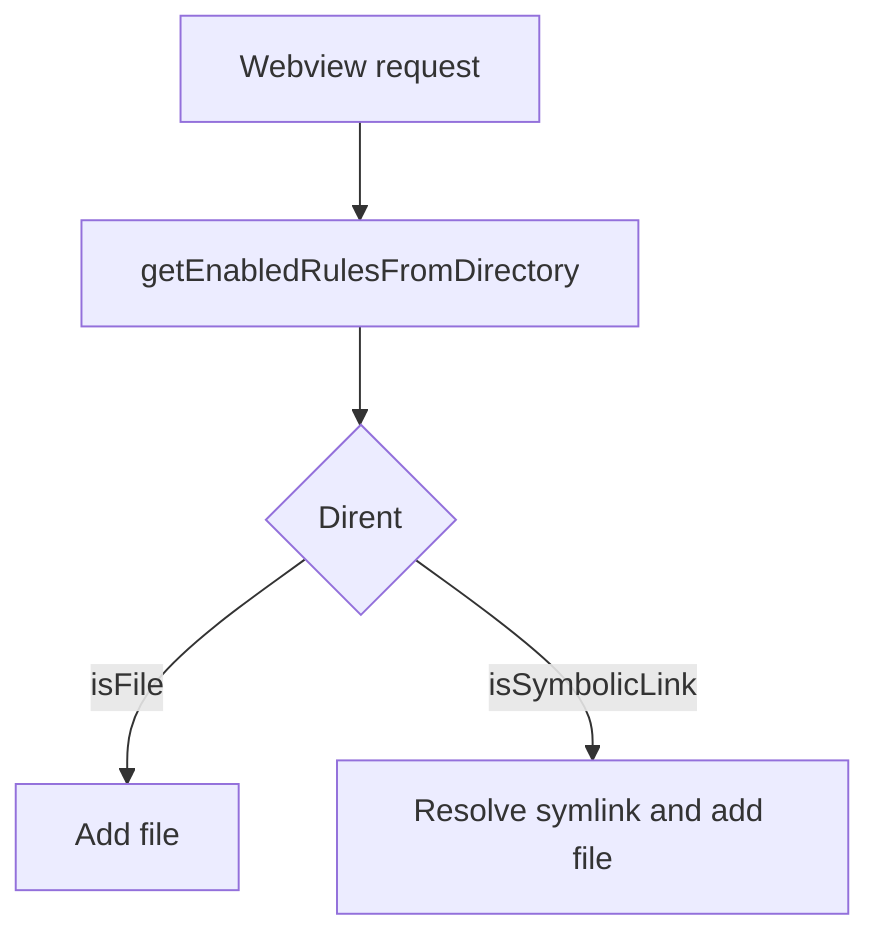
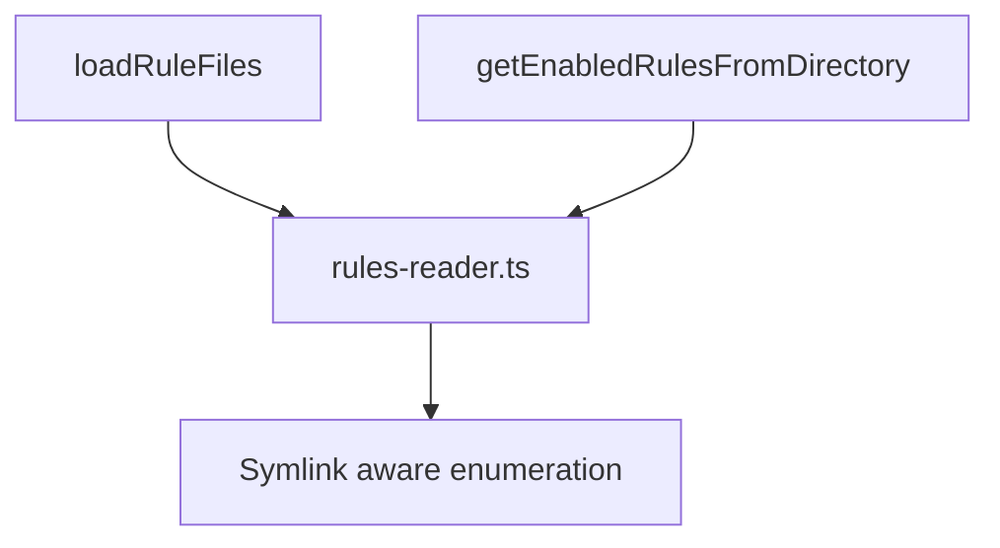
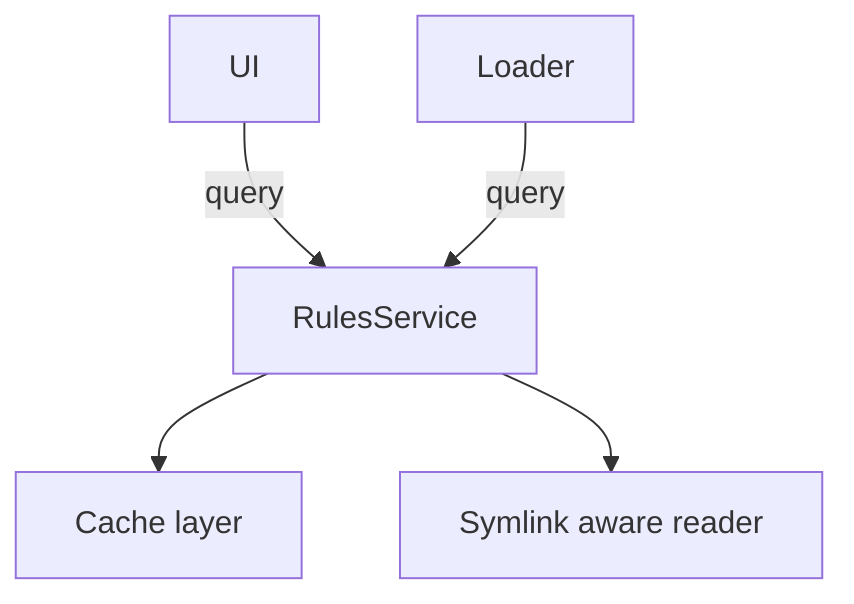

# UNIFY_RULES_DISCOVERY_PLAN

> **Purpose:** Plan options to unify rules discovery (loader vs UI) and eliminate symlink mismatch.

Table of Contents

- [Executive Summary](#executive-summary)
- [Goals](#goals)
- [Constraints & Considerations](#constraints--considerations)
- [Options](#options)
- [Recommendation](#recommendation)
- [Next steps & acceptance criteria](#next-steps--acceptance-criteria)

## Executive Summary

The two code paths to reconcile:

- Loader: [`src/core/prompts/sections/custom-instructions.ts`](src/core/prompts/sections/custom-instructions.ts:211) (resolves symlinks via readTextFilesFromDirectory)
- UI listing: [`src/core/webview/kilorules.ts`](src/core/webview/kilorules.ts:47) (reads dirents, ignores symlinks)

This plan presents three options varying in risk and scope to make discovery consistent.

## Goals

- Ensure symlinked rule files and symlinked directories are discovered identically by loader and UI.
- Preserve existing sorting semantics (symlink order by link name).
- Minimize disruption; provide tests and rollout plan.

## Constraints & Considerations

- Avoid regressions and long-running changes during active releases.
- Respect MAX_DEPTH symlink guard in [`custom-instructions.ts`](src/core/prompts/sections/custom-instructions.ts:57).
- Cross-platform behavior (Windows symlink semantics) — tests skip symlink cases on Windows.

## Options

### Option A — Minimal: make UI symlink-aware

- Change: Update [`getEnabledRulesFromDirectory`](src/core/webview/kilorules.ts:47) to call lstat/readlink+stat for symlinks, include resolved entries in toggles.
- Risk: Low. Small surface area.
- Effort: ~1-2 days including tests.
- Pros: Fast; fixes UI visibility quickly.
- Cons: Duplicate symlink logic remains in two places.

### Option B — Shared util: factor symlink-aware reader

- Change: Extract `readTextFilesFromDirectory` symlink logic into a shared module (`src/utils/rules-reader.ts`) and have both loader and webview consume it.
- Risk: Medium. Refactor touches multiple call sites.
- Effort: ~2-4 days incl. tests and migration.
- Pros: Eliminates duplication; single tested implementation; consistent behavior.
- Cons: Slight refactor effort; ensure webview bundling/imports work for the shared util.

### Option C — RulesService: full centralization and caching

- Change: Implement `RulesService` (singleton) exposing discover(), read(), getToggles(); centralize caching, invalidation, normalization, and telemetry.
- Risk: High. Architectural change.
- Effort: ~1-2 weeks.
- Pros: Best long-term maintainability and performance; single API for consumers.
- Cons: Larger change, more review, migration work.

## Recommendation

- Implement Option A immediately to resolve the user-facing issue.
- Parallel-track Option B to remove duplication and stabilize behavior.
- Consider Option C only if future needs (performance, features) justify the larger investment.

## Next steps & acceptance criteria

1. Create PR for Option A:

    - Update [`src/core/webview/kilorules.ts`](src/core/webview/kilorules.ts:47) to resolve symlinks when building toggles.
    - Add unit tests mirroring symlink tests in [`src/core/prompts/sections/__tests__/custom-instructions.spec.ts`](src/core/prompts/sections/__tests__/custom-instructions.spec.ts:1617).
    - Acceptance: webview shows symlinked rules; CI passes.

2. Implement Option B in follow-up PR:

    - Add `src/utils/rules-reader.ts` with exported API: discover(dir), readFiles(dir), resolveSymlinks(options).
    - Replace call sites: [`src/core/prompts/sections/custom-instructions.ts`](src/core/prompts/sections/custom-instructions.ts:211) and [`src/core/webview/kilorules.ts`](src/core/webview/kilorules.ts:47).
    - Acceptance: behavior identical; tests consolidated.

3. Long-term: evaluate RulesService if caching or richer API needed.

- Back: [`plans/README.md`](plans/README.md:1) · Root: [`README.md`](README.md:1) · Source: `/plans/UNIFY_RULES_DISCOVERY_PLAN.md#L1`
